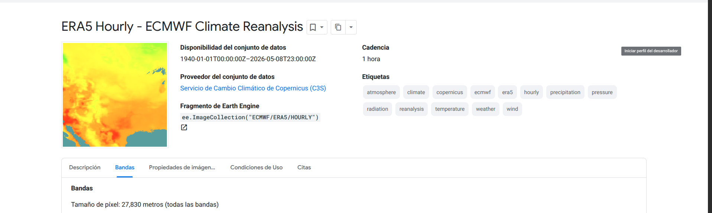

# Datasets — GeoVision-CLIP Cali

Las 6 fuentes satelitales/atmosféricas que integran el panel longitudinal 2021–2026 sobre Cali + corredor industrial Yumbo–Acopi, junto con la justificación de las bandas incluidas y excluidas en cada caso.

## Almacenamiento del panel

- **GCS** ([`gs://fuentes-proyecto-3`](https://console.cloud.google.com/storage/browser/fuentes-proyecto-3)): GeoTIFFs raw (source-of-truth) + `panel.zarr/` de Sentinel-2.
- **HuggingFace** ([`yeigen/fuentes-proyecto-3`](https://huggingface.co/buckets/yeigen/fuentes-proyecto-3)): `panel.zarr/` de las 5 fuentes pequeñas (S5P NO₂/SO₂/O₃, ERA5, MODIS). S2 vive solo en GCS por peso (~84 GB).
- **BBox**: `[-76.65, 3.30, -76.30, 3.65]` (Cali + Yumbo + Acopi, ~38 × 38 km).
- **Ventana temporal**: `2021-01-01` → `2026-01-01` (5 años exactos).
- **Formato dual** GeoTIFF + Zarr: ver [`JUSTIFICACIONES.md`](JUSTIFICACIONES.md#formato-dual-geotiff--zarr).

```
gs://fuentes-proyecto-3/
├── copernicus_s2_sr_harmonized/      raw/*.tif (por banda) + panel.zarr/
├── copernicus_s5p_offl_l3_no2/       raw/*.tif + panel.zarr/
├── copernicus_s5p_offl_l3_so2/       raw/*.tif + panel.zarr/
├── copernicus_s5p_offl_l3_o3/        raw/*.tif + panel.zarr/
├── ecmwf_era5_hourly/                raw/*.tif + panel.zarr/
└── modis_061_mcd19a2_granules/       raw/*.tif + panel.zarr/
```

**Resumen del panel** (30 bandas incluidas de 360 disponibles ≈ 8.3%):

| # | Dataset | Bandas | Imágenes raw | Peso GeoTIFF |
|---|---------|-------:|-------------:|-------------:|
| 1 | Sentinel-2 MSI L2A | 13 / 26 | 19,400 archivos (1,552 escenas) | 76.99 GB |
| 2 | Sentinel-5P NO₂ | 3 / 12 | 25,592 | 0.04 GB |
| 3 | Sentinel-5P SO₂ | 2 / 10 | 25,829 | 0.04 GB |
| 4 | Sentinel-5P O₃ | 2 / 7 | 25,716 | 0.06 GB |
| 5 | ERA5 horario | 8 / 292 | 43,824 | 0.09 GB |
| 6 | MODIS MAIAC | 4 / 13 | 151,558 (gránulos) | 0.02 GB |
| | **Total** | **30 / 360** | | **77.23 GB** (raw, ≥ 50 GB ✅) |

---

## 1. Sentinel-2 MSI L2A (Surface Reflectance Harmonized)


**Asset ID**: `COPERNICUS/S2_SR_HARMONIZED` ([catálogo GEE](https://developers.google.com/earth-engine/datasets/catalog/COPERNICUS_S2_SR_HARMONIZED))

Imágenes ópticas multiespectrales corregidas a reflectancia de superficie (Level-2A). Núcleo del análisis CLIP+SAE; provee covariables ópticas (NDVI, índices urbanos, sombra) que el modelo cruzará con las concentraciones de gases.

| Propiedad | Valor |
|---|---|
| Sensor | MultiSpectral Instrument (MSI) en Sentinel-2A/2B/2C — ESA |
| Resolución nativa | 10 m (B2-B4, B8), 20 m (B5-B7, B8A, B11-B12, SCL), 60 m (B1, B9) |
| Revisita | 5 días (combinando 2A+2B) |
| Imágenes en panel | 1,552 escenas (BBox + ventana 2021-2026) |
| Peso GeoTIFF | 76.99 GB |
| Peso Zarr | ~87 GB (zstd c5 bitshuffle, chunks 5×13×974×974) |

### Bandas incluidas (13 / 26)

| Banda | Nativa | λ central | Justificación |
|---|---|---|---|
| `B1` | 60 m | 443 nm | Aerosol coastal — corrección atmosférica |
| `B2` | 10 m | 492 nm | Azul — dispersión atmosférica |
| `B3` | 10 m | 560 nm | Verde — vegetación sana |
| `B4` | 10 m | 665 nm | Rojo — clorofila, NDVI |
| `B5` | 20 m | 704 nm | Red Edge 1 — transición vegetación |
| `B6` | 20 m | 740 nm | Red Edge 2 — estrés vegetal |
| `B7` | 20 m | 783 nm | Red Edge 3 — continuo borde rojo |
| `B8` | 10 m | 833 nm | NIR — reflectancia vegetación |
| `B8A` | 20 m | 865 nm | NIR estrecho — menos afectado por vapor de agua |
| `B9` | 60 m | 945 nm | Vapor de agua — humedad atmosférica |
| `B11` | 20 m | 1610 nm | SWIR 1 — humedad del suelo |
| `B12` | 20 m | 2190 nm | SWIR 2 — agua y minerales |
| `SCL` | 20 m | — | Scene Classification (nubes, sombras, vegetación, suelo, agua) |

> El PDF pide "13 bandas (B2-B12)", pero B2-B12 son 11 bandas (B10 no existe en L2A). Incluimos B1 (aerosol) y SCL (control de calidad) para completar 13.

### Bandas excluidas (13 / 26)

| Banda | Motivo |
|---|---|
| `AOT`, `WVP` | Subproductos de corrección atmosférica, no reflectancia |
| `TCI_R`, `TCI_G`, `TCI_B` | Imagen RGB pre-renderizada (visualización, no científica) |
| `MSK_CLDPRB`, `MSK_SNWPRB` | Máscaras probabilísticas redundantes con QA60 |
| `QA10`, `QA20` | Banderas de calidad, no variables geofísicas |
| `MSK_CLASSI_OPAQUE`, `MSK_CLASSI_CIRRUS`, `MSK_CLASSI_SNOW_ICE` | Clasificaciones de nubes redundantes con SCL |

### Decisión: resampleo a 10 m

Todas las bandas se descargan con `getDownloadURL(scale=10)` → GEE resamplea **server-side** con interpolación bilineal antes de entregar. Resultado: shape unificado `(13, 3897, 3897)` por imagen.

**Por qué**: la entrada del encoder ViT-B/32 de CLIP (Situación 2) requiere tensores con todas las bandas alineadas. Mantener resoluciones nativas requeriría alineación manual posterior, que termina siendo el mismo resampleo en cliente. Es la práctica estándar (RemoteCLIP, Prithvi, Satlas, GEE catalog default). B1/B9 reportan información de 60 m representada en grilla de 10 m (replicación, no invención).

---

## 2. Sentinel-5P TROPOMI — Dióxido de Nitrógeno (NO₂)


**Asset ID**: `COPERNICUS/S5P/OFFL/L3_NO2` ([catálogo GEE](https://developers.google.com/earth-engine/datasets/catalog/COPERNICUS_S5P_OFFL_L3_NO2))

Columna troposférica de NO₂ medida por TROPOMI. Principal contaminante asociado al tráfico vehicular y combustión industrial en Cali.

| Propiedad | Valor |
|---|---|
| Sensor | TROPOMI / Sentinel-5P / ESA |
| Algoritmo | DOAS (Differential Optical Absorption Spectroscopy) |
| Resolución | 1113 m (0.01°) — re-grilla L3 |
| Resolución nativa L2 | 3.5 × 5.5 km |
| Revisita | Diaria (1–2 órbitas) |
| Disponible desde | 2018-06-28 |
| Imágenes en panel | 25,592 |

### Bandas incluidas (3 / 12)

| Banda | Unidad | Justificación |
|---|---|---|
| `tropospheric_NO2_column_number_density` | mol/m² | **Variable principal**. Columna troposférica vertical |
| `NO2_column_number_density` | mol/m² | Columna total (tropo + estrato). Permite derivar fracción troposférica |
| `cloud_fraction` | 0–1 | Filtro de calidad |

### Bandas excluidas (9 / 12)

| Banda | Motivo |
|---|---|
| `stratospheric_NO2_column_number_density` | NO₂ estratosférico, no afecta calidad del aire superficial |
| `NO2_slant_column_number_density` | Columna inclinada sin corregir, intermedio del DOAS |
| `tropopause_pressure` | Parámetro auxiliar del algoritmo |
| `absorbing_aerosol_index` | Producto de aerosoles, no de NO₂ |
| `sensor_altitude/azimuth/zenith_angle`, `solar_azimuth/zenith_angle` | Geometría de órbita y sol |

---

## 3. Sentinel-5P TROPOMI — Dióxido de Azufre (SO₂)


**Asset ID**: `COPERNICUS/S5P/OFFL/L3_SO2` ([catálogo GEE](https://developers.google.com/earth-engine/datasets/catalog/COPERNICUS_S5P_OFFL_L3_SO2))

Columna vertical de SO₂. En Cali proviene de fuentes antropogénicas (refinerías Yumbo, industria pesada) y contribuye a la formación de aerosoles de sulfato.

| Propiedad | Valor |
|---|---|
| Resolución | 1113 m (0.01°) |
| Resolución nativa L2 | 3.5 × 5.5 km |
| Disponible desde | 2018-12-05 |
| Imágenes en panel | 25,829 |

### Bandas incluidas (2 / 10)

| Banda | Unidad | Justificación |
|---|---|---|
| `SO2_column_number_density` | mol/m² | Variable principal (DOAS sobre SO₂) |
| `cloud_fraction` | 0–1 | Control de calidad |

### Bandas excluidas (8 / 10)

| Banda | Motivo |
|---|---|
| `SO2_slant_column_number_density` | Columna inclinada cruda, intermedio DOAS |
| `SO2_column_number_density_amf` | Air Mass Factor, factor de corrección |
| `SO2_column_number_density_15km` | SO₂ a 15 km (plumas volcánicas, no superficial) |
| `absorbing_aerosol_index` | Producto de aerosoles, no de SO₂ |
| `sensor_azimuth/zenith_angle`, `solar_azimuth/zenith_angle` | Geometría de órbita y sol |

---

## 4. Sentinel-5P TROPOMI — Ozono (O₃)


**Asset ID**: `COPERNICUS/S5P/OFFL/L3_O3` ([catálogo GEE](https://developers.google.com/earth-engine/datasets/catalog/COPERNICUS_S5P_OFFL_L3_O3))

Columna total de O₃ (algoritmo GODFIT). En la troposfera es contaminante nocivo y gas de efecto invernadero.

| Propiedad | Valor |
|---|---|
| Resolución | 1113 m (0.01°) |
| Algoritmo | GODFIT |
| Disponible desde | 2018-09-08 |
| Imágenes en panel | 25,716 |

### Bandas incluidas (2 / 7)

| Banda | Unidad | Justificación |
|---|---|---|
| `O3_column_number_density` | mol/m² | Variable principal (algoritmo GODFIT) |
| `cloud_fraction` | 0–1 | Control de calidad |

### Bandas excluidas (5 / 7)

| Banda | Motivo |
|---|---|
| `O3_effective_temperature` | Parámetro interno del algoritmo, no medición independiente |
| `sensor_azimuth/zenith_angle`, `solar_azimuth/zenith_angle` | Geometría de órbita y sol |

---

## 5. ECMWF ERA5 — Reanálisis Atmosférico Horario



**Asset ID**: `ECMWF/ERA5/HOURLY` ([catálogo GEE](https://developers.google.com/earth-engine/datasets/catalog/ECMWF_ERA5_HOURLY))

Reanálisis climático global de 5ª generación de ECMWF en niveles simples (2D). Combina modelos físicos con observaciones para producir variables atmosféricas horarias.

> **Por qué ERA5 atmosférico y no ERA5-Land**: el PDF menciona ERA5-Land (9 km), pero ese dataset **no contiene** `boundary_layer_height` ni `relative_humidity` — son variables atmosféricas, no de superficie terrestre. Usamos `ECMWF/ERA5/HOURLY` (27.8 km) que sí contiene ambas, conservando las variables que el PDF solicita explícitamente.

| Propiedad | Valor |
|---|---|
| Resolución | 27,830 m (0.25°) |
| Periodicidad | Horaria |
| Cobertura | Global |
| Disponible desde | 1940-01-01 |
| Imágenes en panel | 43,824 (horarias × 5 años) |

### Bandas incluidas (8 / 292)

| Banda | Unidad | Justificación |
|---|---|---|
| `temperature_2m` | K | Temperatura — dispersión atmosférica |
| `dewpoint_temperature_2m` | K | Punto de rocío — derivación de RH (Magnus) |
| `u_component_of_wind_10m` | m/s | Viento este — transporte horizontal |
| `v_component_of_wind_10m` | m/s | Viento norte |
| `boundary_layer_height` | m | **BLH** — crítica para modelado de dispersión |
| `relative_humidity_850hPa` | % | RH a ~1500 m — formación de aerosoles secundarios |
| `surface_pressure` | Pa | Presión — corrección de columnas |
| `total_precipitation` | m | Lavado por lluvia (remoción de contaminantes) |

### Bandas excluidas (284 / 292)

| Categoría | Ejemplos | Motivo |
|---|---|---|
| Variables oceánicas | `sea_surface_temperature`, `ice_temperature_layer_1-4` | Cali no es zona costera |
| Nieve | `snow_depth`, `snow_albedo`, `snowfall` | Cali no tiene nieve |
| Lagos | `lake_*_temperature`, `lake_ice_depth` | Irrelevante para calidad del aire |
| Radiación | `surface_net_solar/thermal_radiation`, `surface_uv_radiation` | No requeridas |
| Viento otras alturas | `u/v_component_of_wind_100m`, `wind_gust` | El proyecto pide viento a 10 m |
| Precipitación por tipo | `convective/large_scale_precipitation/snowfall` | Usamos `total_precipitation` (suma) |
| Evaporación | `mean_evaporation_rate`, `potential_evaporation` | No requeridas |
| Estrés y ondas | `turbulent_surface_stress`, `gravity_wave_stress` | Dinámica fina no requerida |
| Suelo | `soil_temperature_level_1-4`, `volumetric_soil_water_layer_1-4` | Variables de superficie terrestre |
| Otras | `skin_temperature`, `mean_sea_level_pressure`, `runoff` | No requeridas |

> **Sobre el BBox**: ERA5 entrega bounds `[-76.75, 3.25, -76.25, 3.75]` (0.5° × 0.5°) en lugar del recorte solicitado. Es la grilla nativa de 0.25°: el BBox de Cali no cae exactamente en la grilla, GEE entrega la matriz 2×2 que cubre el área completa.

---

## 6. MODIS MCD19A2 — MAIAC Aerosol Optical Depth (AOD)


**Asset ID**: `MODIS/061/MCD19A2_GRANULES` ([catálogo GEE](https://developers.google.com/earth-engine/datasets/catalog/MODIS_061_MCD19A2_GRANULES))

Profundidad óptica de aerosoles del algoritmo MAIAC (Multi-Angle Implementation of Atmospheric Correction) sobre MODIS Terra + Aqua. **Proxy** de material particulado PM₂.₅/PM₁₀ a nivel superficie.

| Propiedad | Valor |
|---|---|
| Sensor | MODIS Terra + MODIS Aqua / NASA |
| Algoritmo | MAIAC v6.1 (NASA Goddard) |
| Resolución | 927 m (~1 km) |
| Disponible desde | 2000-02-24 |
| Imágenes en panel | 151,558 gránulos crudos → agrupados por fecha en `panel.zarr` |

### Bandas incluidas (4 / 13)

| Banda | Unidad | Justificación |
|---|---|---|
| `Optical_Depth_047` | 0.001 | AOD a 0.47 μm (azul) — banda primaria, proxy PM |
| `Optical_Depth_055` | 0.001 | AOD a 0.55 μm (verde) — validación cruzada |
| `Column_WV` | 0.001 | Columna de vapor de agua — afecta aerosoles higroscópicos |
| `AOD_QA` | bitfield | Banderas de calidad — filtro de píxeles confiables |

### Bandas excluidas (9 / 13)

| Categoría | Motivo |
|---|---|
| QA flags internos MAIAC | Máscaras nube/nieve/agua, redundantes con `AOD_QA` |
| Parámetros del modelo de aerosoles | Fracción modo fino/grueso, internos del algoritmo |
| Incertidumbre de la recuperación | Diagnóstico, no variable de entrada |
| Ángulos de visión MODIS | Geometría del sensor |

> **Sobre archivos vacíos**: MODIS son swaths, no global daily. Muchos gránulos pasan por el BBox pero el raster sobre Cali es mayoritariamente `_FillValue=-28672` o uint8 todo cero. No es bug — es la realidad del producto. El script `modis_a_zarr.py:procesar_fecha` agrupa los gránulos del mismo día y promedia (reduce los 151,558 raw a una serie diaria coherente).

---

## DAGMA / SISAIRE (Ground Truth puntual)

9 estaciones del DAGMA monitoreando NO₂, SO₂, O₃ in-situ con periodicidad horaria. Sirve como **leave-one-out cross-validation** del modelo Kriging Espacio-Temporal (Situación 3).

La red cubre solo 9 puntos sobre 564 km², dejando amplias zonas sin monitoreo (laderas, zona industrial Yumbo–Acopi). El modelo geoespacial proyecta estos 9 valores a una superficie continua usando los embeddings CLIP como información auxiliar.

**Fuentes**: [SISAIRE — IDEAM](http://sisaire.ideam.gov.co) · [DAGMA Cali](https://www.cali.gov.co/dagma/) · [Resolución 2254 de 2017](https://www.minambiente.gov.co/wp-content/uploads/2021/10/resolucion-2254-de-2017.pdf) (niveles permisibles).

---

## Acceso al panel desde código

```python
import xarray as xr

# Desde HF Bucket (5 datasets pequeños)
base = "https://huggingface.co/buckets/yeigen/fuentes-proyecto-3"
ds_era5 = xr.open_zarr(f"{base}/ecmwf_era5_hourly/panel.zarr", consolidated=False)

# Desde GCS (todos, incluido S2)
import gcsfs
fs = gcsfs.GCSFileSystem()
ds_s2 = xr.open_zarr(
    fs.get_mapper("fuentes-proyecto-3/copernicus_s2_sr_harmonized/panel.zarr"),
    consolidated=True,
)
# Dimensions: (time: 1552, band: 13, y: 3897, x: 3897)

# NDVI al vuelo
red = ds_s2["data"].sel(band="B4")
nir = ds_s2["data"].sel(band="B8")
ndvi = (nir.astype("float32") - red) / (nir + red)
```

Enlaces oficiales de cada dataset en [`REFERENCIAS.md`](REFERENCIAS.md). Justificaciones técnicas del formato, pesos y método de exportación en [`JUSTIFICACIONES.md`](JUSTIFICACIONES.md).
