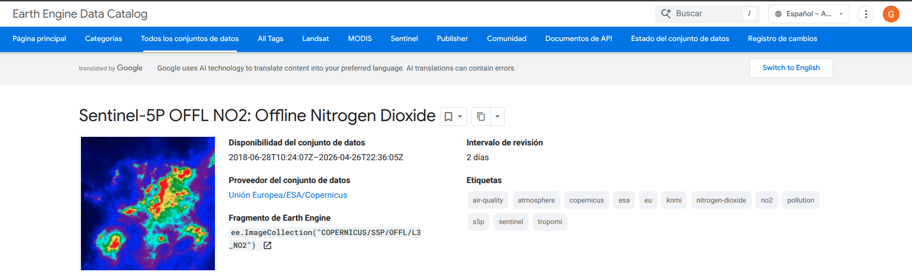
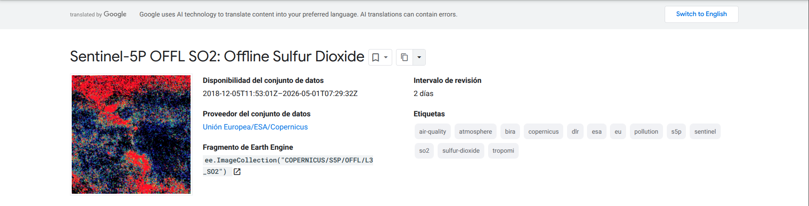
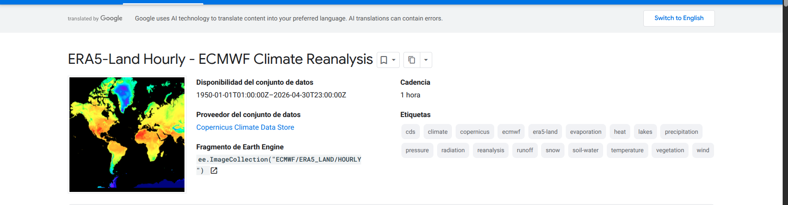

# Datasets — GeoVision-CLIP Cali

Documentación de las 6 fuentes satelitales/atmosféricas que integran el panel longitudinal 2021–2026 sobre Cali + corredor industrial Yumbo–Acopi.

## Almacenamiento del panel

- **Bucket GCS**: [`gs://fuentes-proyecto-3`](https://console.cloud.google.com/storage/browser/fuentes-proyecto-3) (proyecto `proyecto-analitica-3-495618`)
- **BBox**: `[-76.65, 3.30, -76.30, 3.65]` (Cali + Yumbo + Acopi, ~38 × 38 km)
- **Ventana temporal**: `2021-01-01` → `2026-01-01` (5 años, conforme a Situación 1 del [PDF de la asignatura](../proyecto/ProyectoFinal_GeoVisionCLIP_Cali.pdf))
- **Formato dual**: GeoTIFF (raw, source-of-truth) + Zarr (panel analítico). Justificado en [`JUSTIFICACION_FORMATO.md`](JUSTIFICACION_FORMATO.md)

```
gs://fuentes-proyecto-3/
├── copernicus_s2_sr_harmonized/
│   ├── raw/{system_index}__{banda}.tif        # 1 archivo por (imagen, banda)
│   └── panel.zarr/                            # Zarr 4D (time, band, y, x)
├── copernicus_s5p_offl_l3_no2/
│   ├── raw/{system_index}.tif                 # multi-banda
│   └── batch_NNNN.zarr/                       # Zarr por batch de 50 imágenes
├── copernicus_s5p_offl_l3_so2/   (idem)
├── copernicus_s5p_offl_l3_o3/    (idem)
├── ecmwf_era5_hourly/            (idem)
└── modis_061_mcd19a2_granules/   (idem)
```

| Comando para listar | |
|---|---|
| `gcloud storage ls gs://fuentes-proyecto-3/` | listar prefijos |
| `gcloud storage du -s gs://fuentes-proyecto-3/` | tamaño total |

---

## 1. Sentinel-2 MSI L2A (Surface Reflectance Harmonized)


**Asset ID**: `COPERNICUS/S2_SR_HARMONIZED` ([catálogo GEE](https://developers.google.com/earth-engine/datasets/catalog/COPERNICUS_S2_SR_HARMONIZED))

Imágenes ópticas multiespectrales corregidas a reflectancia de superficie (Level-2A). Núcleo del análisis CLIP+SAE para teledetección de alta resolución. Provee covariables ópticas (NDVI, índices urbanos, sombra) que el modelo cruza con las concentraciones de gases.

| Propiedad | Valor |
|---|---|
| Sensor | MultiSpectral Instrument (MSI) en Sentinel-2A/2B/2C — ESA Copernicus |
| Resolución espacial | 10 m (B2-B4, B8), 20 m (B5-B7, B8A, B11, B12, SCL), 60 m (B1, B9) |
| Revisita | 5 días (combinando 2A+2B) |
| Bandas catálogo | 26 disponibles, 13 incluidas |
| Fechas en panel | 2021-01-01 → 2026-01-01 |
| Imágenes en panel | **1,552** (intersección con BBox, sin filtro de nubosidad) |
| Peso GeoTIFF | ~77 GB |
| Peso Zarr (proyectado) | ~87 GB (zstd/c5/bitshuffle, chunks 5×13×974×974) |

### Bandas incluidas (13 / 26)

| Banda | Nativa | λ central | Justificación |
|---|---|---|---|
| `B1` | 60 m | 443 nm | Aerosol coastal — corrección atmosférica |
| `B2` | 10 m | 492 nm | Azul — dispersión atmosférica |
| `B3` | 10 m | 560 nm | Verde — vegetación sana |
| `B4` | 10 m | 665 nm | Rojo — clorofila, NDVI |
| `B5` | 20 m | 704 nm | Red Edge 1 — transición vegetación |
| `B6` | 20 m | 740 nm | Red Edge 2 — estrés vegetal |
| `B7` | 20 m | 783 nm | Red Edge 3 — continuo borde rojo |
| `B8` | 10 m | 833 nm | NIR — reflectancia vegetación |
| `B8A` | 20 m | 865 nm | NIR estrecho — menos afectado por vapor de agua |
| `B9` | 60 m | 945 nm | Vapor de agua — humedad atmosférica |
| `B11` | 20 m | 1610 nm | SWIR 1 — humedad del suelo |
| `B12` | 20 m | 2190 nm | SWIR 2 — agua y minerales |
| `SCL` | 20 m | — | Scene Classification (nubes, sombras, vegetación, suelo, agua) |

> **Nota**: el PDF pide *"13 bandas (B2-B12)"*, pero B2-B12 son 11 bandas (B10 no existe en L2A). Incluimos B1 (aerosol) y SCL (control de calidad) para completar 13. Justificación detallada en [`BANDAS_JUSTIFICACION.md`](BANDAS_JUSTIFICACION.md).

### Decisión: resampleo a 10 m

Todas las bandas se descargan con `getDownloadURL(scale=10)` → GEE las resamplea **en el servidor** con interpolación bilineal antes de entregar. Resultado: shape unificado `(13, 3897, 3897)` por imagen.

**Por qué**: la entrada del encoder ViT-B/32 de CLIP (Situación 2) requiere tensores con todas las bandas alineadas. Mantener resoluciones nativas requeriría alineación manual posterior, que termina siendo el mismo resampleo en cliente. Es la práctica estándar (RemoteCLIP, Prithvi, Satlas, GEE catalog default). B1/B9 reportan información de 60m representada en grilla de 10m (replicación, no invención de info).

**Referencias**:
- [Sentinel-2 User Handbook (ESA)](https://sentinel.esa.int/documents/247904/685211/Sentinel-2_User_Handbook)
- [Sentinel-2 MSI Technical Guide](https://sentiwiki.copernicus.eu/web/s2-mission)
- [GEE Projections and Reprojection](https://developers.google.com/earth-engine/guides/projections)

---

## 2. Sentinel-5P TROPOMI — Dióxido de Nitrógeno (NO₂)



**Asset ID**: `COPERNICUS/S5P/OFFL/L3_NO2` ([catálogo GEE](https://developers.google.com/earth-engine/datasets/catalog/COPERNICUS_S5P_OFFL_L3_NO2))

Columna troposférica de NO₂ medida por TROPOMI. Principal contaminante asociado al tráfico vehicular y combustión industrial en Cali.

| Propiedad | Valor |
|---|---|
| Sensor | TROPOMI (TROPOspheric Monitoring Instrument), Sentinel-5P / ESA |
| Resolución | 1113 m (0.01°) — re-grilla L3 |
| Resolución nativa L2 | 3.5 × 5.5 km |
| Algoritmo | DOAS (Differential Optical Absorption Spectroscopy) |
| Disponible desde | 2018-06-28 |
| Imágenes en panel | 25,592 |
| Bandas seleccionadas | 3 (de 12) |

| Banda | Unidad | Uso |
|---|---|---|
| `tropospheric_NO2_column_number_density` | mol/m² | **Variable principal**. Columna troposférica vertical |
| `NO2_column_number_density` | mol/m² | Columna total (tropo + estrato). Permite derivar fracción troposférica |
| `cloud_fraction` | 0–1 | Filtro de calidad |

**Referencias**:
- [Sentinel-5P TROPOMI Mission Page (ESA)](https://sentinels.copernicus.eu/web/sentinel/missions/sentinel-5p)
- [Algorithm Theoretical Basis Document (ATBD) NO2](https://sentiwiki.copernicus.eu/web/document-library#DocumentLibrary-S5P-RELEVANTDOCUMENTS)
- [TROPOMI L3 OFFL NO2 GEE catalog](https://developers.google.com/earth-engine/datasets/catalog/COPERNICUS_S5P_OFFL_L3_NO2)

---

## 3. Sentinel-5P TROPOMI — Dióxido de Azufre (SO₂)



**Asset ID**: `COPERNICUS/S5P/OFFL/L3_SO2` ([catálogo GEE](https://developers.google.com/earth-engine/datasets/catalog/COPERNICUS_S5P_OFFL_L3_SO2))

Columna vertical de SO₂. En Cali proviene de fuentes antropogénicas (refinerías Yumbo, industria pesada) y aporta a la formación de aerosoles de sulfato.

| Propiedad | Valor |
|---|---|
| Resolución | 1113 m (0.01°) |
| Resolución nativa L2 | 3.5 × 5.5 km |
| Disponible desde | 2018-12-05 |
| Imágenes en panel | 25,830 |
| Bandas seleccionadas | 2 (de 10) |

| Banda | Unidad | Uso |
|---|---|---|
| `SO2_column_number_density` | mol/m² | Variable principal |
| `cloud_fraction` | 0–1 | Filtro de calidad |

**Referencias**: [Sentinel-5P SO2 GEE](https://developers.google.com/earth-engine/datasets/catalog/COPERNICUS_S5P_OFFL_L3_SO2) · [TROPOMI SO2 ATBD](https://sentinels.copernicus.eu/web/sentinel/technical-guides/sentinel-5p/products-algorithms)

---

## 4. Sentinel-5P TROPOMI — Ozono (O₃)


**Asset ID**: `COPERNICUS/S5P/OFFL/L3_O3` ([catálogo GEE](https://developers.google.com/earth-engine/datasets/catalog/COPERNICUS_S5P_OFFL_L3_O3))

Columna total de O₃ (algoritmo GODFIT). En la troposfera es contaminante nocivo y gas de efecto invernadero.

| Propiedad | Valor |
|---|---|
| Resolución | 1113 m (0.01°) |
| Disponible desde | 2018-09-08 |
| Imágenes en panel | 25,717 |
| Bandas seleccionadas | 2 (de 7) |

| Banda | Unidad | Uso |
|---|---|---|
| `O3_column_number_density` | mol/m² | Variable principal (algoritmo GODFIT) |
| `cloud_fraction` | 0–1 | Filtro de calidad |

**Referencias**: [Sentinel-5P O3 GEE](https://developers.google.com/earth-engine/datasets/catalog/COPERNICUS_S5P_OFFL_L3_O3) · [TROPOMI O3 ATBD](https://sentinels.copernicus.eu/web/sentinel/user-guides/sentinel-5p-tropomi)

---

## 5. ECMWF ERA5 — Reanálisis Atmosférico Horario



**Asset ID**: `ECMWF/ERA5/HOURLY` ([catálogo GEE](https://developers.google.com/earth-engine/datasets/catalog/ECMWF_ERA5_HOURLY))

Reanálisis climático global de 5ª generación de ECMWF. Combina modelos físicos con observaciones para producir variables atmosféricas horarias.

| Propiedad | Valor |
|---|---|
| Resolución | 27,830 m (0.25°) — grilla nativa |
| Cobertura | Global |
| Disponible desde | 1940-01-01 |
| Imágenes en panel | 34,499 (horarias) |
| Bandas seleccionadas | 8 (de 292) |

| Banda | Unidad | Uso |
|---|---|---|
| `temperature_2m` | K | Temperatura — dispersión atmosférica |
| `dewpoint_temperature_2m` | K | Punto de rocío — derivación de RH (Magnus) |
| `u_component_of_wind_10m` | m/s | Viento este (transporte horizontal) |
| `v_component_of_wind_10m` | m/s | Viento norte |
| `boundary_layer_height` | m | **BLH** — crítica para modelado de dispersión |
| `relative_humidity_850hPa` | % | RH a ~1500 m — formación de aerosoles secundarios |
| `surface_pressure` | Pa | Presión — corrección de columnas |
| `total_precipitation` | m | Lavado por lluvia (remoción de contaminantes) |

> **Decisión clave**: el PDF pide ERA5-**Land** pero ese dataset **no contiene `boundary_layer_height` ni `relative_humidity`** (es un downscale de superficie a 9 km). Usamos ERA5 atmosférico horario (`ECMWF/ERA5/HOURLY`) que sí los contiene. Trade-off: 27.8 km vs 9 km de resolución, a cambio de las variables que el PDF solicita explícitamente.

> **Sobre el BBox**: ERA5 entrega bounds [-76.75, 3.25, -76.25, 3.75] (0.5° × 0.5°) en lugar de [-76.65, 3.30, -76.30, 3.65]. **No es ruido**, es la grilla nativa de 0.25°: el BBox de Cali no cae exactamente en la grilla, GEE entrega la matriz 2×2 que cubre el área completa. Recortarlo más agresivo perdería cobertura.

**Referencias**:
- [ERA5 hourly data on single levels (Copernicus C3S)](https://cds.climate.copernicus.eu/cdsapp#!/dataset/reanalysis-era5-single-levels)
- [ERA5 documentation (ECMWF)](https://confluence.ecmwf.int/display/CKB/ERA5%3A+data+documentation)
- [ECMWF/ERA5/HOURLY GEE catalog](https://developers.google.com/earth-engine/datasets/catalog/ECMWF_ERA5_HOURLY)
- [ERA5 vs ERA5-Land comparison](https://confluence.ecmwf.int/display/CKB/ERA5-Land%3A+data+documentation)

---

## 6. MODIS MCD19A2 — MAIAC Aerosol Optical Depth (AOD)


**Asset ID**: `MODIS/061/MCD19A2_GRANULES` ([catálogo GEE](https://developers.google.com/earth-engine/datasets/catalog/MODIS_061_MCD19A2_GRANULES))

Profundidad óptica de aerosoles del algoritmo MAIAC (Multi-Angle Implementation of Atmospheric Correction) sobre MODIS Terra+Aqua. **Proxy** de material particulado PM₂.₅/PM₁₀ a nivel superficie.

| Propiedad | Valor |
|---|---|
| Sensor | MODIS Terra + MODIS Aqua / NASA |
| Algoritmo | MAIAC v6.1 (NASA Goddard) |
| Resolución | 927 m (~1 km) |
| Cobertura | Global |
| Disponible desde | 2000-02-24 |
| Imágenes en panel | en descarga (MODIS son swaths múltiples por día) |
| Bandas seleccionadas | 4 (de 13) |

| Banda | Unidad | Uso |
|---|---|---|
| `Optical_Depth_047` | 0.001 | AOD a 0.47 μm (azul) — banda primaria |
| `Optical_Depth_055` | 0.001 | AOD a 0.55 μm (verde) — validación cruzada |
| `Column_WV` | 0.001 | Columna de vapor de agua — afecta aerosoles higroscópicos |
| `AOD_QA` | bitfield | Banderas de calidad — filtro de píxeles confiables |

> **Sobre los archivos vacíos**: MODIS son **swaths**, no global daily. Muchos gránulos pasan por el footprint del BBox pero el raster sobre Cali es mayoritariamente `_FillValue=-28672` o uint8 todo cero. **No es bug**, es la realidad del producto: los gránulos son segmentos de la órbita MODIS y solo algunos cubren Cali con datos válidos. El manifest final filtra los que no aportan información.

**Referencias**:
- [MAIAC ATBD (NASA Goddard)](https://atmosphere-imager.gsfc.nasa.gov/sites/default/files/ModAtmo/MAIAC_ATBD_v1.pdf)
- [MCD19A2 v061 product page (NASA LP DAAC)](https://lpdaac.usgs.gov/products/mcd19a2v061/)
- [MODIS MCD19A2 GEE catalog](https://developers.google.com/earth-engine/datasets/catalog/MODIS_061_MCD19A2_GRANULES)

---

## DAGMA / SISAIRE (Ground Truth puntual)

**Fuente**: [SISAIRE — Sistema de Información sobre Calidad del Aire (IDEAM)](http://sisaire.ideam.gov.co)

9 estaciones del DAGMA (Departamento Administrativo de Gestión del Medio Ambiente de Cali) monitoreando NO₂, SO₂, O₃ in-situ con periodicidad horaria. Sirve como **leave-one-out cross-validation** del modelo Kriging Espacio-Temporal (Situación 3).

**Por qué es relevante**: la red DAGMA cubre solo 9 puntos sobre 564 km², dejando amplias zonas sin monitoreo (laderas, zona industrial Yumbo–Acopi). El modelo geoespacial proyecta estos 9 valores a una superficie continua usando los embeddings CLIP como información auxiliar.

**Referencias**:
- [Resolución 2254 de 2017 (Min. Ambiente)](https://www.minambiente.gov.co/wp-content/uploads/2021/10/resolucion-2254-de-2017.pdf) — niveles permisibles
- [Reportes SISAIRE](http://sisaire.ideam.gov.co)
- [DAGMA Cali](https://www.cali.gov.co/dagma/)

---

## Acceso al panel desde código

```python
import xarray as xr

# --- Desde HF Bucket (recomendado) ---
# Instalar: pip install huggingface_hub[hf_xet]
s2_url = "https://yeigen-fuentes-proyecto-3.hf.space/copernicus_s2_sr_harmonized/panel.zarr"
ds_s2 = xr.open_zarr(s2_url, consolidated=True)
print(ds_s2)
# Dimensions: (time: 1552, band: 13, y: 3897, x: 3897)

# Cálculo de NDVI al vuelo
red = ds_s2["data"].sel(band="B4")
nir = ds_s2["data"].sel(band="B8")
ndvi = (nir.astype("float32") - red) / (nir + red)

# --- Desde GCS (alternativa) ---
import gcsfs
fs = gcsfs.GCSFileSystem()

# Sentinel-2: panel consolidado 4D
ds_s2 = xr.open_zarr(fs.get_mapper(
    "fuentes-proyecto-3/copernicus_s2_sr_harmonized/panel.zarr"
), consolidated=True)

# S5P NO2 por batch
ds_no2 = xr.open_zarr(fs.get_mapper(
    "fuentes-proyecto-3/copernicus_s5p_offl_l3_no2/batch_0001.zarr"
), consolidated=True)
```

## Referencias generales

- [PDF de la asignatura](../proyecto/ProyectoFinal_GeoVisionCLIP_Cali.pdf) — Situación 1, p. 3-4
- [`JUSTIFICACION_FORMATO.md`](JUSTIFICACION_FORMATO.md) — por qué GeoTIFF + Zarr
- [`BANDAS_JUSTIFICACION.md`](BANDAS_JUSTIFICACION.md) — justificación banda por banda
- [Zarr v3 specification](https://zarr-specs.readthedocs.io/en/latest/v3/core/v3.0.html)
- [xarray docs](https://docs.xarray.dev/)
- [Pangeo: Cloud Native Geospatial](https://pangeo.io/)
- [Cloud Optimized GeoTIFF spec](https://www.cogeo.org/)
