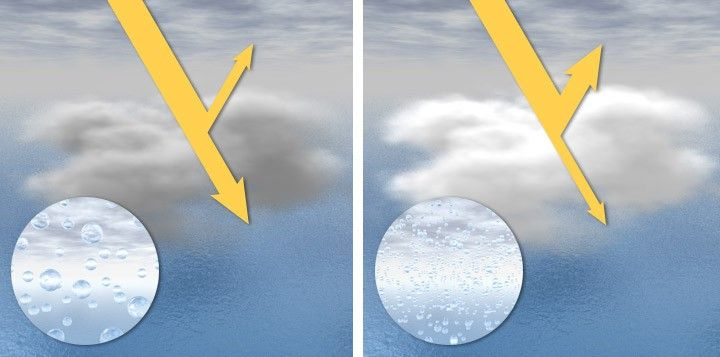
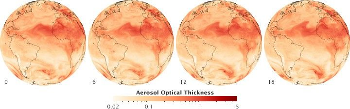

# Atmósfera y medición satelital

La contaminación que interesa al proyecto ocurre principalmente cerca de la superficie, pero muchos satélites no miden directamente a nivel de calle. Miden radiación reflejada o absorbida a través de una columna de atmósfera.

## Columna atmosférica vs superficie

Una estación DAGMA/CVC mide concentración puntual cerca del suelo. Sentinel-5P mide columnas de gases en la atmósfera. Por eso una columna alta de NO2, SO2 u O3 no equivale automáticamente a una medición superficial alta.

Esta diferencia es clave para interpretar la Situación 2 y la Situación 3.

## Capa límite atmosférica

La capa límite es la parte baja de la atmósfera que mezcla emisiones, calor, humedad y viento. Cuando la capa límite es baja, los contaminantes se concentran más cerca del suelo. Cuando es alta, se diluyen en más volumen de aire.

En el proyecto se usa `boundary_layer_height` de ERA5 como contexto de dispersión.

## Aerosoles y nubes

Los aerosoles son partículas pequeñas suspendidas en el aire. Pueden venir de polvo, humo, industria, combustión o fuentes naturales. También afectan nubes, visibilidad y salud.

MODIS MAIAC aporta AOD como proxy de aerosoles, aunque no reemplaza mediciones de PM2.5 o PM10.

## Recursos visuales

Fuente: [NASA image — aerosol indirect effect diagram](https://assets.science.nasa.gov/dynamicimage/assets/science/esd/eo/content-feature/aerosols/images/indirect_effect_diagram.jpg?w=720&h=357&fit=clip&crop=faces%2Cfocalpoint)

Fuente: [NASA image — aerosol transport model](https://assets.science.nasa.gov/dynamicimage/assets/science/esd/eo/content-feature/aerosols/images/aerosol_transport.jpg?w=720&h=225&fit=clip&crop=faces%2Cfocalpoint)

Referencia: [NASA Earth Observatory — Aerosols: Tiny Particles, Big Impact](https://science.nasa.gov/earth/earth-observatory/aerosols/)

## Documentos relacionados

- [Capas de la atmósfera](../conceptos/atmosfera-capas.md)
- [Columnas troposféricas y DOAS](../conceptos/columnas-troposfericas-doas.md)
- [Capa límite BLH](../conceptos/capa-limite-blh.md)
- [ERA5](../situacion-1/fuentes/era5.md)
- [MODIS MAIAC](../situacion-1/fuentes/modis-maiac.md)
