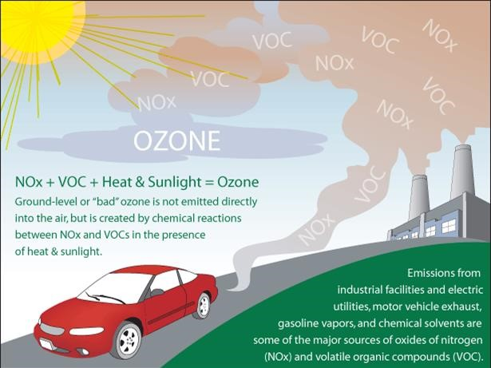

# Contaminantes

El proyecto trabaja principalmente con NO2, SO2, O3 y aerosoles. Cada contaminante tiene una lectura distinta.

## NO2

El dióxido de nitrógeno se asocia con combustión, tráfico vehicular, transporte pesado e industria. En el proyecto aparece como:

- columna troposférica de Sentinel-5P;
- medición superficial en DAGMA/CVC, principalmente Yumbo.

Limitación: en la verdad observada principal, NO2 solo está disponible en una estación.

## SO2

El dióxido de azufre suele relacionarse con combustión con azufre, industria y algunas fuentes naturales. En el proyecto se usa como columna satelital y como medición de estaciones.

Limitación: el cruce con DAGMA/CVC en Situación 2 no respaldó fuertemente la clase SO2.

## O3

El ozono tiene dos lecturas:

- ozono estratosférico: protector frente a radiación UV;
- ozono superficial: contaminante secundario asociado a NOx, VOC y luz solar.

Sentinel-5P en este proyecto usa columna total de O3, no O3 superficial directo. Por eso `ozono_anomalo` se interpreta con cuidado.

## Aerosoles y PM

Los aerosoles son partículas suspendidas. MODIS MAIAC mide AOD, que es una señal óptica relacionada con aerosoles. No equivale directamente a PM2.5 o PM10 superficial.

## Recurso visual

Fuente: [EPA image — ground-level ozone formation](https://www.epa.gov/sites/default/files/2018-10/ozone_formation.jpg)

## Recursos directos

- [EPA — Basic Information about NO2](https://www.epa.gov/no2-pollution/basic-information-about-no2)
- [EPA — Sulfur Dioxide Basics](https://www.epa.gov/so2-pollution/sulfur-dioxide-basics)
- [EPA — Ground-level Ozone Basics](https://www.epa.gov/ground-level-ozone-pollution/ground-level-ozone-basics)
- [NASA Earth Observatory — Aerosols](https://science.nasa.gov/earth/earth-observatory/aerosols/)

## Documentos relacionados

- [NO2](../conceptos/contaminante-no2.md)
- [SO2](../conceptos/contaminante-so2.md)
- [O3](../conceptos/contaminante-o3.md)
- [Material particulado y AOD](../conceptos/material-particulado-aod.md)
- [Sentinel-5P](../situacion-1/fuentes/sentinel-5p.md)
