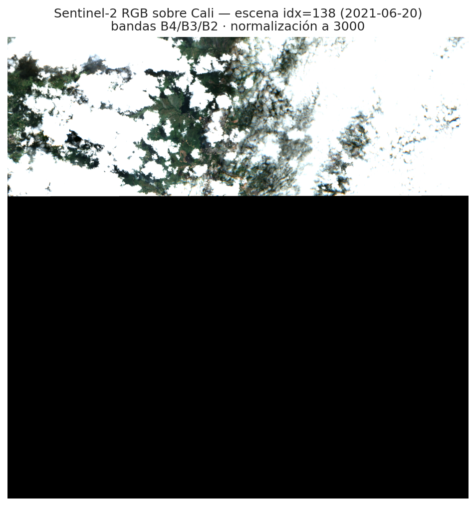
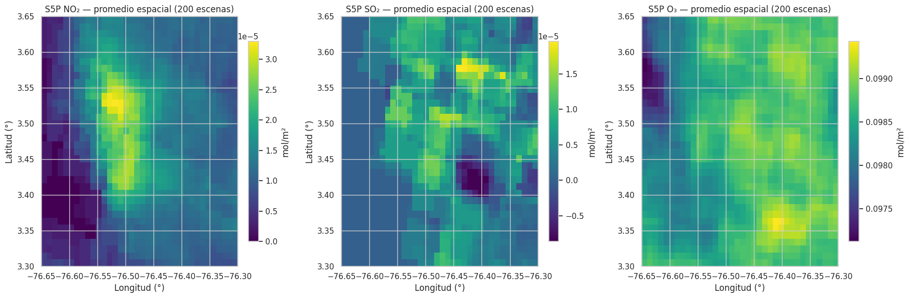
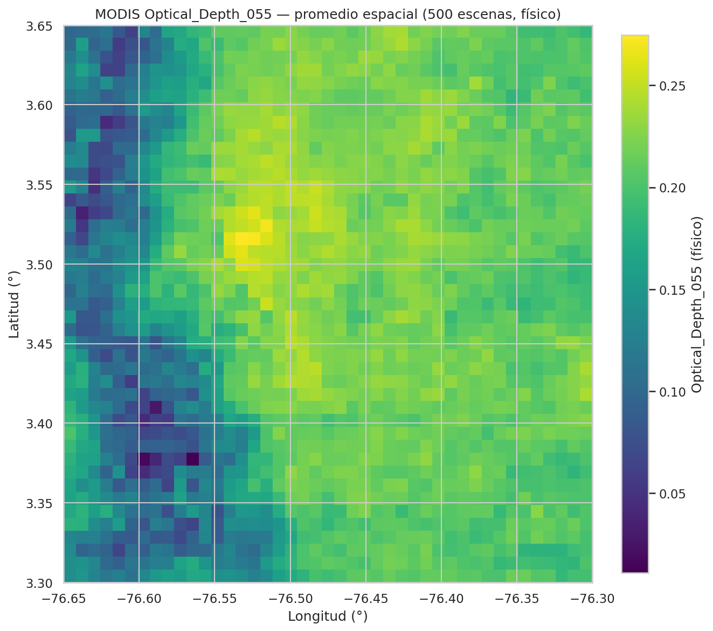
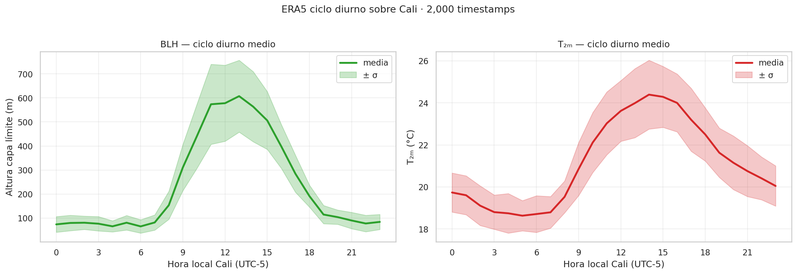
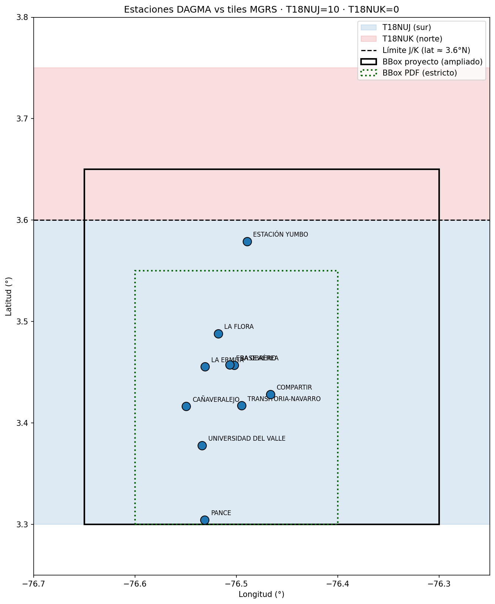

# Datos del proyecto

El proyecto combina fuentes que observan cosas distintas: superficie, columnas atmosféricas, aerosoles, meteorología y mediciones en estaciones.

## Sentinel-2

Mide reflectancia óptica de superficie. En el proyecto permite ver ciudad, vegetación, suelo, agua, sombras, nubes y patrones territoriales.

Uso principal: generar tiles visuales de 64×64 píxeles para CLIP.

Fuente interna: [Escena RGB Sentinel-2](../situacion-1/evidencias/eda/sentinel-2/s2_rgb_escena_138.png)

## Sentinel-5P

Mide columnas atmosféricas de gases. En el proyecto se usan NO2, SO2 y O3.

Uso principal: construir pseudo-labels de contaminación para muestreo estratificado y contexto atmosférico.

Fuente interna: [Mapas promedio Sentinel-5P](../situacion-1/evidencias/eda/s5p/s5p_mapas_promedio.png)

## MODIS MAIAC

Mide AOD y vapor de agua. AOD es una señal óptica relacionada con aerosoles, no una medición directa de PM2.5 o PM10.

Uso principal: contexto atmosférico y revisión de aerosoles.

Fuente interna: [Mapa promedio MODIS](../situacion-1/evidencias/eda/modis/v2/modis_mapa_promedio.png)

## ERA5

Aporta reanálisis meteorológico horario: temperatura, punto de rocío, viento, humedad, presión, precipitación y altura de capa límite.

Uso principal: explicar mezcla y dispersión de contaminantes.

Fuente interna: [Ciclo diurno ERA5](../situacion-1/evidencias/eda/era5/era5_ciclo_diurno.png)

## DAGMA/CVC

Mide NO2, SO2 y O3 en estaciones de monitoreo. Es la verdad observada principal para Situación 3.

Uso principal: validación contra mediciones de superficie.

Fuente interna: [Estaciones DAGMA vs tiles MGRS](../situacion-3/evidencias/dagma/figuras/dagma_estaciones_vs_tile_mgrs.png)

## Resumen rápido

| Fuente | Mide | Rol |
|---|---|---|
| Sentinel-2 | Superficie visible/multiespectral | Imagen para CLIP |
| Sentinel-5P | Columnas de gases | Pseudo-labels y contexto |
| MODIS MAIAC | AOD y vapor de agua | Aerosoles/contexto |
| ERA5 | Meteorología horaria | Dispersión y mezcla |
| DAGMA/CVC | Contaminantes en estaciones | Verdad observada |

## Recursos directos

- [Sentinel-2 MSI Level-2A en Earth Engine](https://developers.google.com/earth-engine/datasets/catalog/COPERNICUS_S2_SR_HARMONIZED)
- [Sentinel-5P NO2 en Earth Engine](https://developers.google.com/earth-engine/datasets/catalog/COPERNICUS_S5P_OFFL_L3_NO2)
- [Sentinel-5P SO2 en Earth Engine](https://developers.google.com/earth-engine/datasets/catalog/COPERNICUS_S5P_OFFL_L3_SO2)
- [Sentinel-5P O3 en Earth Engine](https://developers.google.com/earth-engine/datasets/catalog/COPERNICUS_S5P_OFFL_L3_O3)
- [MODIS MAIAC MCD19A2.061 en Earth Engine](https://developers.google.com/earth-engine/datasets/catalog/MODIS_061_MCD19A2_GRANULES)
- [ERA5 Hourly en Earth Engine](https://developers.google.com/earth-engine/datasets/catalog/ECMWF_ERA5_HOURLY)

## Documentos relacionados

- [Datasets](../DATASETS.md)
- [Panel Zarr](../situacion-1/capas/panel-zarr.md)
- [Fuentes Situación 1](../situacion-1/README.md#fuentes)
