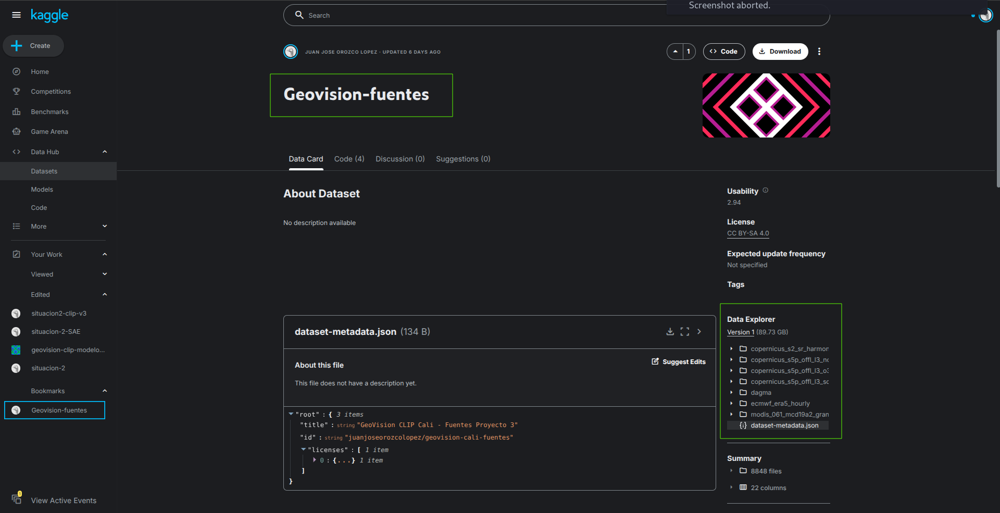
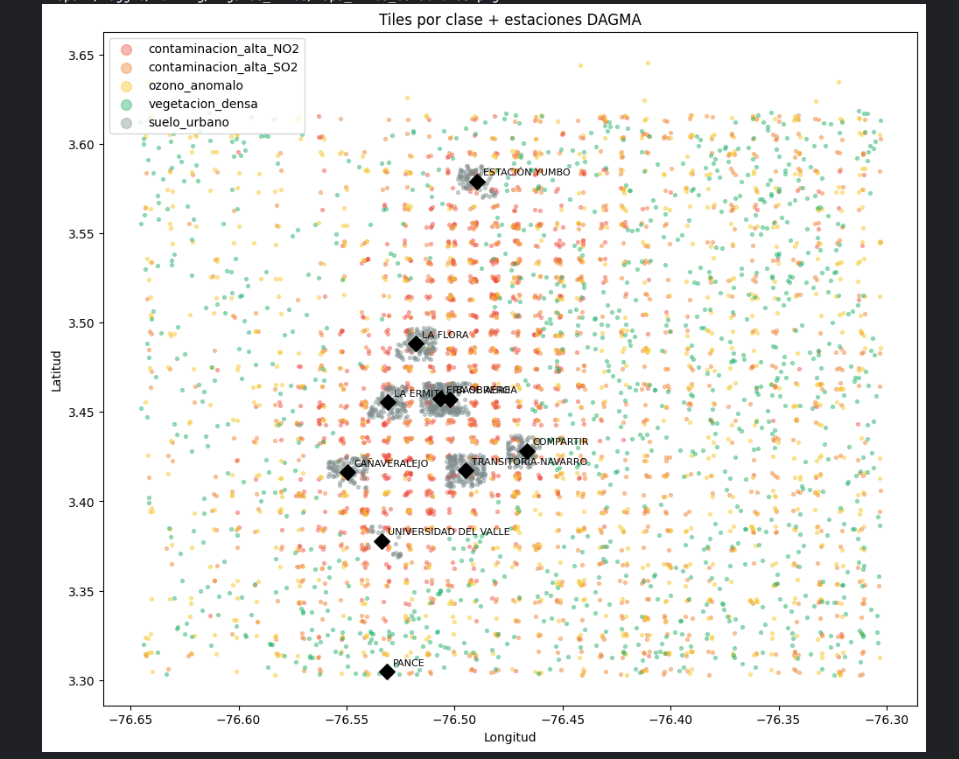
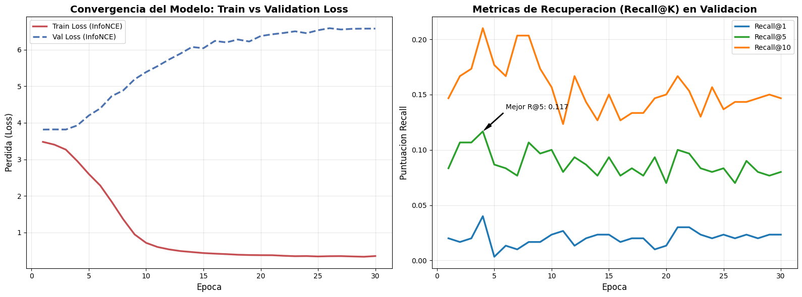
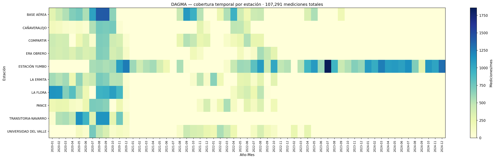

# Modelo y validación

El proyecto no busca solo reunir datos. Busca probar si las señales visuales y atmosféricas ayudan a representar o estimar contaminación.

## Flujo completo

```text
Panel multi-fuente
        ↓
Tiles Sentinel-2 + textos
        ↓
CLIP fine-tuneado
        ↓
Embeddings visuales/textuales
        ↓
SAE + AFE/AFC
        ↓
ConvLSTM / Kriging / LOO-CV
```

## Situación 1

Construye el panel de datos. Valida cobertura, rangos físicos, formatos y publicación.



Fuente interna: [Dataset Kaggle del panel](../situacion-1/evidencias/panel/sit1_panel_kaggle_dataset.png)

## Situación 2

Genera 5,000 tiles balanceados y entrena un modelo CLIP sin usar S5P como atajo directo. Luego analiza embeddings con SAE, AFE y AFC.



Fuente interna: [Mapa de tiles y estaciones](../situacion-2/evidencias/muestreo/tiles/mapa_tiles_estaciones.png)



Fuente interna: [Curvas de entrenamiento CLIP](../situacion-2/evidencias/entrenamiento/sit2_entrenamiento_curvas_aprendizaje.png)

## Situación 3

Evalúa si las representaciones ayudan a estimar contaminantes en estaciones no vistas. El mejor resultado práctico fue Kriging Ordinario sobre coordenadas para SO2 y O3. NO2 no permite LOO-CV porque solo tiene una estación en la verdad observada principal.



Fuente interna: [Cobertura temporal DAGMA](../situacion-3/evidencias/dagma/figuras/dagma_cobertura_temporal.png)

## Lectura final

El panel multi-fuente y los embeddings son útiles para representación y exploración. La validación predictiva estricta queda limitada por la cantidad y distribución de estaciones.

## Recursos directos

- [CLIP paper](https://arxiv.org/abs/2103.00020)
- [RemoteCLIP paper](https://ieeexplore.ieee.org/document/10504785)
- [ConvLSTM paper](https://arxiv.org/abs/1506.04214)
- [PyKrige documentation](https://geostat-framework.readthedocs.io/projects/pykrige/en/stable/)

## Documentos relacionados

- [Situación 2](../situacion-2/README.md)
- [Arquitectura CLIP + SAE](../situacion-2/metodologia/arquitectura-clip-sae.md)
- [Situación 3](../situacion-3/README.md)
- [Kriging y LOO-CV](../situacion-3/resultados/kriging-loocv.md)
