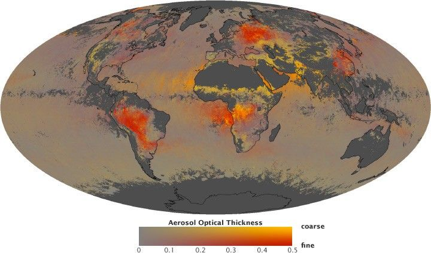

# El problema

La contaminación atmosférica no se distribuye de forma uniforme. Cambia por tráfico, industria, topografía, viento, humedad, lluvia, hora del día y mezcla atmosférica.

En este proyecto el área de interés es Cali + Yumbo + Acopi porque combina:

- zona urbana densa;
- corredor industrial;
- transporte pesado;
- estaciones de monitoreo;
- cultivos y quemas estacionales cercanas;
- condiciones meteorológicas que pueden transportar contaminantes.

## Pregunta práctica

¿Podemos usar imágenes satelitales, meteorología y estaciones para construir una representación espacial útil de la contaminación atmosférica?

## Por qué no basta una sola fuente

- Las estaciones miden bien, pero solo en pocos puntos.
- Los satélites cubren más territorio, pero miden columnas o proxies, no siempre concentración superficial.
- La meteorología explica por qué una misma emisión puede concentrarse o dispersarse.

Por eso el proyecto combina fuentes en lugar de elegir una sola.

## Recurso visual

Fuente: [NASA image — global aerosol distribution](https://assets.science.nasa.gov/dynamicimage/assets/science/esd/eo/content-feature/aerosols/images/aerosol_fine_fraction_depth_201008_hammer.jpg?w=720&h=424&fit=clip&crop=faces%2Cfocalpoint)

Referencia: [NASA Earth Observatory — Aerosols: Tiny Particles, Big Impact](https://science.nasa.gov/earth/earth-observatory/aerosols/)

## Documentos relacionados

- [Situación 1](../situacion-1/README.md)
- [BBox operativo](../situacion-1/resultados/panel.md)
- [DAGMA/CVC](../situacion-1/fuentes/dagma-cvc.md)
