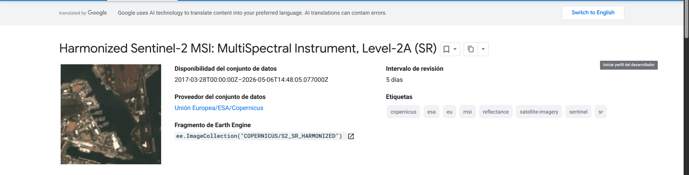
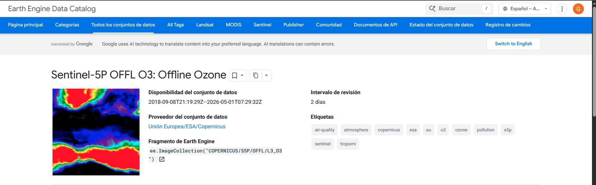
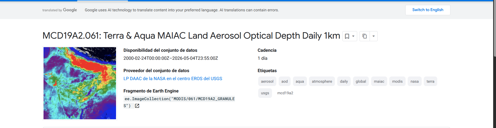

ESTIMAR LA CONTAMINACIÓN EN PUNTOS NO MUESTRADOS A PARTIR DE PUNTOS YA MUESTREADOS EN CALI

La fuentes para lograr esto son las siguientes:

> **Nota sobre periodos**: El PDF especifica ciertas periodicidades que difieren de lo que realmente entrega GEE. La diferencia mas importante esta en Sentinel-5P: el PDF pide el producto **L2 OFFL** (nivel 2) que tiene cobertura diaria con 1-2 orbitas, pero nosotros usamos el producto **L3** de GEE que tiene una **revisita de 2 dias**.

En esta etapa se documenta la idea inicial del proyecto. Las ventanas temporales finales pueden ajustarse segun la disponibilidad real de cada fuente en GEE y de las mediciones de estaciones.

| Fuente | Variable | Resolucion | Periodo segun PDF | Periodo GEE | Diferencia clave |
|---|---|---|---|---|---|
| Sentinel-5P NO2 | NO2 troposferico | ~1.1 km (L3) / 3.5x5.5 km (L2 nativa) | Diaria (1-2 orbitas) | 2 dias | PDF pide L2; nosotros usamos L3 de GEE |
| Sentinel-5P SO2 | Columna vertical SO2 | ~1.1 km (L3) / 3.5x5.5 km (L2 nativa) | Diaria | 2 dias | PDF pide L2; nosotros usamos L3 de GEE |
| Sentinel-5P O3 | Columna total O3 | ~1.1 km (L3) | Diaria | 2 dias | PDF pide L2; nosotros usamos L3 de GEE |
| Sentinel-2 MSI | 13 bandas (B1-B12, SCL) | 10/20/60 m (nativa) -> 10 m en panel | 5 dias | 5 dias | Coincide |
| MODIS MCD19A2 | AOD (proxy PM) | ~1 km (927 m) | Diaria | 1 dia | Coincide |
| ERA5 Hourly | T2m, viento, BLH, RH | 27.8 km (0.25 deg) | Horaria | 1 hora | Coincide en periodicidad, pero cambiamos ERA5-Land por ERA5 Hourly |
| DAGMA | NO2, SO2, O3 medidos en estaciones | 9 estaciones puntuales | Horaria | N/A | Coincide |
| CVC (Yumbo) | NO2 medido en estacion | 1 estacion puntual | Horaria | N/A | No esta en el PDF; agregada por necesidad de modelado |

## Imagenes de referencia

### Sentinel-2 MSI

El conjunto de datos Sentinel-2 MSI Nivel-2A (SR) Harmonizado proporciona imagenes multiespectrales de alta resolucion y gran amplitud de franja para monitoreo terrestre. Los datos posteriores al 25 de enero de 2022, con linea base de procesamiento '04.00' o superior, han sido desplazados para coincidir con el rango de datos de las escenas mas antiguas en esta coleccion harmonizada. El conjunto de datos esta disponible desde el 28 de marzo de 2017 y tiene un intervalo de revisita de 5 dias. Los datos incluyen 12 bandas espectrales UINT16 que representan Reflectancia de Superficie (SR) escalada por 10000, junto con bandas adicionales especificas del Nivel-2.

### Sentinel-5P NO2

Este conjunto de datos proporciona imagenes offline de alta resolucion de concentraciones de Dioxido de Nitrogeno (NO2). El NO2 es un gas traza importante en la atmosfera, resultado de procesos antropicos y naturales. Los datos provienen del instrumento TROPOMI del satelite Sentinel-5 Precursor, que monitorea la contaminacion del aire. Los datos originales de Sentinel 5P Nivel 2 son procesados a productos L3 para su uso en Earth Engine.

### Sentinel-5P SO2

Este conjunto de datos proporciona imagenes offline de alta resolucion de concentraciones de dioxido de azufre (SO2) atmosferico. El dioxido de azufre (SO2) ingresa a la atmosfera terrestre tanto por procesos naturales como antropicos. Juega un papel en la quimica a escala local y global, y su impacto va desde la contaminacion a corto plazo hasta efectos en el clima. Los datos son recopilados por el sensor TROPOMI en el satelite Sentinel-5 Precursor, con un intervalo de revisita de 2 dias y alta resolucion espacial para detectar plumas de SO2.

### Sentinel-5P O3

Este conjunto de datos proporciona imagenes offline de alta resolucion de concentraciones de ozono en columna total. En la estratosfera, la capa de ozono protege a la biosfera de la peligrosa radiacion ultravioleta solar. En la troposfera, actua como un agente limpiador eficiente, pero en alta concentracion tambien se vuelve danino para la salud de humanos, animales y vegetacion. El ozono tambien es un importante gas de efecto invernadero que contribuye al cambio climatico actual. Los productos offline en este conjunto de datos son generados usando el algoritmo GODFIT y procesados a formato L3 a partir de datos originales L2.

### MODIS MCD19A2 (AOD)

El producto de datos MCD19A2 V6.1 es un producto combinado MODIS Terra y Aqua de Profundidad Optica de Aerosoles Terrestres (MAIAC) con Implementacion Multi-angulo de Correccion Atmosferica, producido diariamente a 1 km de resolucion. Las bandas clave incluyen Profundidad Optica de Aerosoles a 0.47 μm y 0.55 μm, Incertidumbre de AOD, Fraccion de Modo Fino y Vapor de Agua en Columna.

### ERA5 Hourly

ERA5 es la quinta generacion de reanalisis atmosferico global del clima de ECMWF. Es producido por el Servicio de Cambio Climatico Copernicus (C3S) en ECMWF. El reanalisis combina datos de modelos con observaciones de todo el mundo en un conjunto de datos globalmente completo y consistente usando las leyes de la fisica. ERA5 proporciona estimaciones horarias para una gran cantidad de variables atmosfericas, de olas oceanicas y superficiales terrestres. Los datos cubren la Tierra en una grilla de aproximadamente 31 km y resuelven la atmosfera usando 137 niveles desde la superficie hasta una altura de 80 km. Este conjunto de datos representa los datos de 'niveles simples', que contienen parametros 2D.

## Comparacion: bandas y variables del PDF vs las que usamos

Aquí lo que vamos a hacer es contrastar lo que dice el PDF con lo que hicimos nosotros, ya que algunas especificaciones son bastante ambiguas.

### Sentinel-2 MSI

| | Detalle |
|---|---|
| **PDF pide** | "13 bandas (B2-B12)" |
| **Ambiguedad** | B2-B12 en L2A son solo 11 bandas porque B10 no existe en el producto de reflectancia de superficie. |
| **Proyecto usa** | B1, B2, B3, B4, B5, B6, B7, B8, B8A, B9, B11, B12, SCL = **13 bandas** |
| **Nota** | Se incluyen B1 (aerosol costero, util para correccion atmosferica) y SCL (clasificacion de escena, filtro de nubes y sombras) para completar las 13 bandas |

### Sentinel-5P NO2

| | Detalle |
|---|---|
| **PDF pide** | NO2 troposferico |
| **Proyecto usa** | `tropospheric_NO2_column_number_density`, `NO2_column_number_density`, `cloud_fraction` = **3 bandas** |
| **Nota** | Ademas de la columna troposferica principal, se incluye la columna total como referencia y `cloud_fraction` como filtro de calidad. |

### Sentinel-5P SO2

| | Detalle |
|---|---|
| **PDF pide** | Columna vertical SO2 |
| **Proyecto usa** | `SO2_column_number_density`, `cloud_fraction` = **2 bandas** |
| **Nota** | Se incluye `cloud_fraction` para filtrar mediciones afectadas por nubosidad. |

### Sentinel-5P O3

| | Detalle |
|---|---|
| **PDF pide** | Columna total O3 |
| **Proyecto usa** | `O3_column_number_density`, `cloud_fraction` = **2 bandas** |
| **Nota** | Igual que SO2, se agrega `cloud_fraction` como control de calidad. |

### MODIS MCD19A2

| | Detalle |
|---|---|
| **PDF pide** | AOD como proxy de material particulado (PM) |
| **Ambiguedad** | El PDF no especifica que bandas de AOD ni si incluir calidad. |
| **Proyecto usa** | `Optical_Depth_047`, `Optical_Depth_055`, `Column_WV`, `AOD_QA` = **4 bandas** |
| **Nota** | Se incluyen dos longitudes de onda de AOD (azul y verde), vapor de agua en columna y el bitfield de calidad `AOD_QA`. |

### ERA5 Hourly

| | Detalle |
|---|---|
| **PDF pide** | ERA5-Land con variables de temperatura, viento, altura de capa limite y humedad |
| **Ambiguedad** | El PDF menciona ERA5-Land (~9 km), pero ese dataset **no contiene** `boundary_layer_height` ni `relative_humidity_850hPa`. Son variables atmosfericas, no de superficie terrestre. |
| **Proyecto usa** | ERA5 Hourly (~27.8 km) con 8 variables: `temperature_2m`, `dewpoint_temperature_2m`, `u_component_of_wind_10m`, `v_component_of_wind_10m`, `boundary_layer_height`, `relative_humidity_850hPa`, `surface_pressure`, `total_precipitation` |
| **Nota** | Se sacrifica resolucion espacial para conservar las variables que el PDF solicita explicitamente. |

### DAGMA

| | Detalle |
|---|---|
| **PDF pide** | 9 estaciones DAGMA |
| **Proyecto usa** | 9 estaciones DAGMA |
| **Nota** | Las 9 estaciones DAGMA son la base inicial para comparar las estimaciones del proyecto con mediciones reales de NO2, SO2 y O3. La disponibilidad final por contaminante se revisara en las demas situaciones. |

### CVC (Yumbo)

| | Detalle |
|---|---|
| **PDF pide** | No menciona CVC explicitamente |
| **Proyecto usa** | 1 estacion CVC (ESTACION YUMBO) |
| **Nota** | La estacion Yumbo, operada por CVC, cae dentro del BBox ampliado. Se incluye desde el inicio como apoyo posible para comparar estimaciones de NO2 en la zona industrial Yumbo-Acopi. |
