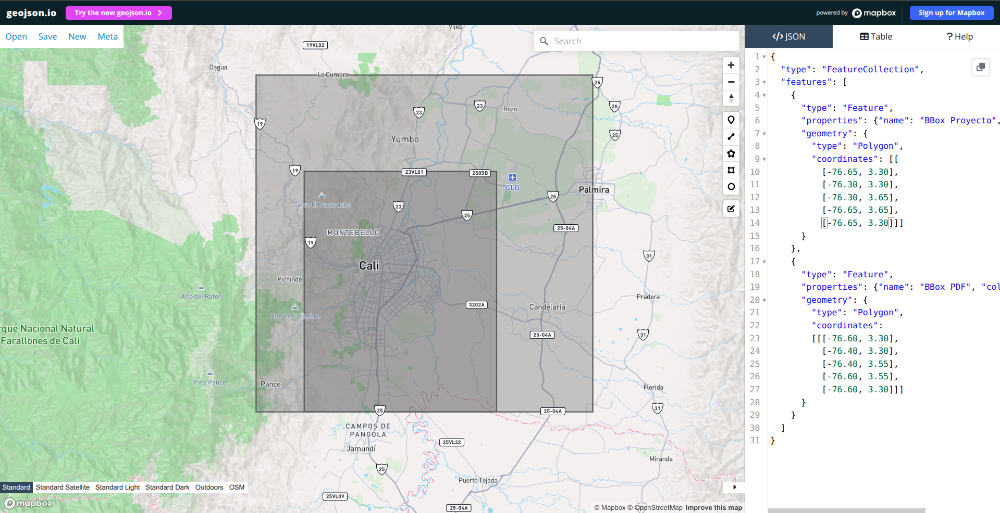

# Situacion 1: construccion del panel

La Situacion 1 consiste en dejar listo el panel de datos que alimenta el resto del proyecto. Todavia no se entrena el modelo principal: primero habia que reunir las fuentes, organizarlas, publicarlas y verificar que fueran reutilizables.

## Que pedia el PDF

El PDF pedia construir un panel analitico de minimo 50 GB con 5 anos de informacion sobre Cali, incluyendo el corredor industrial Yumbo-Acopi.

El panel debia integrar:

- Sentinel-5P para NO2, SO2 y O3.
- Sentinel-2 para imagenes opticas de alta resolucion.
- ERA5 para variables meteorologicas.
- MODIS MAIAC para aerosoles.
- Mediciones de estaciones DAGMA/SISAIRE.

Tambien pedia guardar los datos en un formato eficiente como Zarr o Parquet, publicar el panel, construir un manifest con hashes MD5 y hacer un EDA inicial.

## Que hicimos nosotros

Construimos un panel longitudinal 2021-2025 usando una ventana tecnica `2021-01-01` a `2026-01-01` para las fuentes de GEE.

Las fuentes principales fueron:

| Fuente | Rol | Shape / volumen principal |
|---|---|---:|
| Sentinel-2 MSI | Imagen optica de superficie | `(1552, 13, 3897, 3897)` |
| Sentinel-5P NO2 | Columna satelital de NO2 | `(25592, 3, 36, 36)` |
| Sentinel-5P SO2 | Columna satelital de SO2 | `(25829, 2, 36, 36)` |
| Sentinel-5P O3 | Columna total de O3 | `(25716, 2, 36, 36)` |
| ERA5 Hourly | Meteorologia horaria | `(43824, 8, 2, 2)` |
| MODIS MAIAC | Aerosoles y vapor de agua | `(1826, 4, 43, 43)` |
| DAGMA/CVC | Mediciones de estaciones | `107291` filas |

El resultado publicado en Kaggle pesa **89.73 GB**, por encima del minimo de 50 GB. Kaggle muestra **8848 archivos** y el manifest tecnico registra **8847 archivos de datos**; la diferencia es el archivo `dataset-metadata.json` que Kaggle cuenta en su interfaz.

## BBox usado

El PDF pedia este BBox:

```text
[-76.60, 3.30, -76.40, 3.55]
```

Nosotros usamos uno mas amplio:

```text
[-76.65, 3.30, -76.30, 3.65]
```

La diferencia es la siguiente:



La caja mas grande es la que usamos en el proyecto y la mas pequena es la que pide el PDF.

La ampliacion permite incluir mejor Yumbo, Acopi y parte del norte agricola. Esto importa porque el problema de contaminacion no termina en el borde administrativo de Cali: el corredor industrial y los vientos pueden afectar la ciudad.

## Flujo de datos

El flujo fue:

```text
Google Earth Engine
        ->
GeoTIFF raw en Google Cloud Storage
        ->
Conversion a paneles Zarr
        ->
Publicacion en Kaggle Dataset y Hugging Face
        ->
Consumo por notebooks de las demas situaciones
```

GCS guarda los archivos raw y los paneles Zarr. Kaggle es la fuente practica para trabajar en notebooks. Hugging Face se usa como respaldo publico para los paneles mas pequenos.

## Publicacion y evidencia

El panel quedo publicado en tres lugares:

- GCS: `gs://fuentes-proyecto-3`.
- Hugging Face: `yeigen/fuentes-proyecto-3`.
- Kaggle Dataset: `juanjoseorozcolopez/geovision-fuentes`.

Evidencias principales:

- [Bucket GCS](../situacion-1/evidencias/panel/sit1_panel_bucket_gcs.png)
- [Bucket Hugging Face](../situacion-1/evidencias/panel/sit1_panel_bucket_hugging_face.png)
- [Dataset Kaggle](../situacion-1/evidencias/panel/sit1_panel_kaggle_dataset.png)
- [Manifest tecnico](../../manifest/manifest_output/manifest.json)

## Validaciones y EDA

Para revisar que el panel no fuera solo una descarga grande, se hicieron varias validaciones:

- Manifest con tamanos, rutas y hashes MD5.
- Revision de conteos entre Kaggle y el manifest.
- Conversion GeoTIFF a Zarr revisada en fuentes clave.
- Revision de rangos fisicos para Sentinel-5P, ERA5 y MODIS.
- EDA por fuente para ver cobertura, distribuciones y problemas de calidad.

Algunos hallazgos importantes:

- Sentinel-2 es la fuente dominante en peso: cerca de 77 GB.
- Cali tiene mucha nubosidad, por eso pocas escenas Sentinel-2 tienen alta cobertura util.
- Sentinel-5P entrega columnas atmosfericas, no concentraciones a nivel de calle.
- ERA5 tiene cobertura horaria continua y ayuda a explicar dispersion por viento y mezcla atmosferica.
- MODIS necesito correccion hasta llegar a una version confiable (`panel_v3.zarr`).

## Limitaciones de esta fase

La Situacion 1 deja el panel listo, pero no resuelve todo el proyecto.

Las principales limitaciones son:

- La nubosidad afecta Sentinel-2, Sentinel-5P y MODIS.
- O3 de Sentinel-5P es columna total, no ozono superficial directo.
- MODIS AOD tiene baja cobertura en una zona tropical nublada como Cali.
- El campo global `spatial_extent.bbox` del manifest conserva el BBox del PDF, aunque el BBox operativo real esta en `google-earth/config.py`.

## Cierre

La Situacion 1 deja una base comun para las demas situaciones: datos publicados, formatos reutilizables, manifest verificable y EDA inicial. Su valor principal es que el resto del proyecto ya no depende de descargas manuales ni archivos sueltos.
