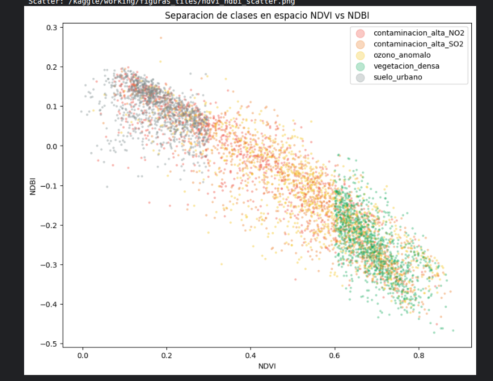
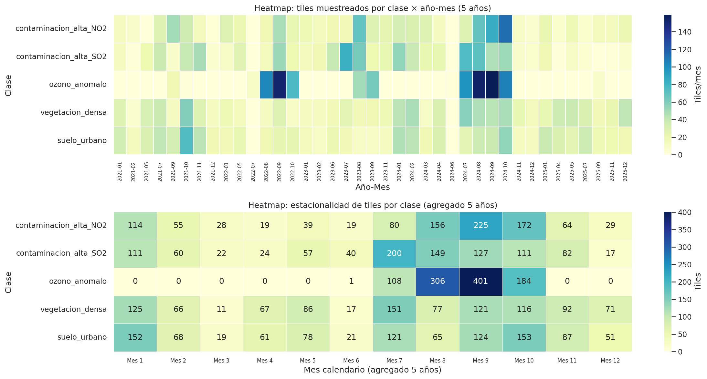
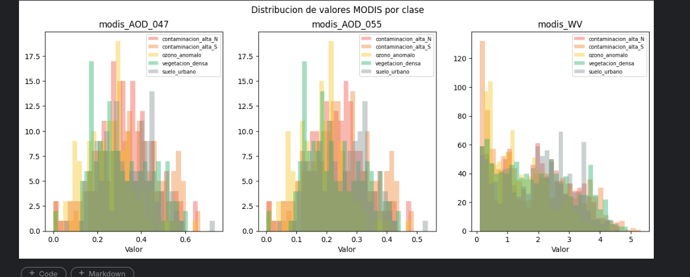
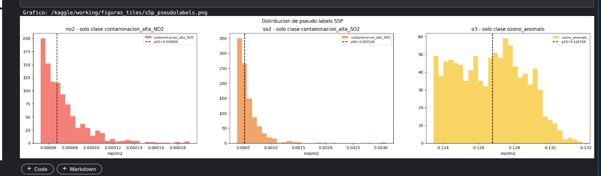

# Situacion 2 — GeoVision-CLIP + SAE + AFE/AFC

## Resumen

Modelo multimodal CLIP fine-tuneado con LoRA sobre tiles Sentinel-2 (64x64x12) de Cali,
entrenado con 5,000 pares imagen-texto balanceados en 5 clases de contaminacion y cobertura del suelo.
Posteriormente: Sparse Autoencoder sobre embeddings, Analisis Factorial Exploratorio (PCA + Varimax)
y Confirmatorio (CFI/RMSEA).

## Tiles de entrenamiento

Los tiles se extraen del panel satelital construido en Situacion 1.
Cada tile es un recorte de 64x64 pixeles (640x640 m) de una escena Sentinel-2.

**Archivos:**

| Archivo | Forma | Peso |
|---|---|---|
| `tiles_train.npz` | (5000, 13, 64, 64) float32 | 229 MB |
| `tiles_meta.parquet` | 5000 x 22 columnas | 0.3 MB |
| `scl_por_escena.csv` | 1552 x 3 | 0.1 MB |

**Dataset en Kaggle:** `edwardsx/geovision-tiles-sit2`

**Columnas de `tiles_meta.parquet` (22):**

| Tipo | Columnas |
|---|---|
| Clase | `clase` (5 clases) |
| Temporal | `time_s2` (79 fechas unicas) |
| Geo | `lat`, `lon` |
| Indices espectrales | `ndvi`, `ndbi`, `scl_pct` |
| Pseudo-labels S5P | `no2`, `so2`, `o3` |
| Texto | `texto` (descripcion en espanol) |
| Contexto ERA5 | `era5_T2m`, `era5_Td2m`, `era5_u10`, `era5_v10`, `era5_BLH`, `era5_RH850`, `era5_psurf`, `era5_precip` |
| Contexto MODIS | `modis_AOD_047`, `modis_AOD_055`, `modis_WV` |

**Distribucion de clases (5,000 tiles balanceados):**

| Clase | Tiles | Estrategia de muestreo |
|---|---|---|
| contaminacion_alta_NO2 | 1,000 | Guiada por S5P (NO2 > p90) |
| contaminacion_alta_SO2 | 1,000 | Guiada por S5P (SO2 > p90) |
| ozono_anomalo | 1,000 | Guiada por S5P (O3 > p95) |
| vegetacion_densa | 1,000 | Aleatoria + NDVI > 0.6 |
| suelo_urbano | 1,000 | Proximidad a estaciones DAGMA + NDVI < 0.3 |

### Calculo: de 136 escenas S2 a 5,000 tiles

Cada escena Sentinel-2 del panel es de 3,897 x 3,897 pixeles a 10 m de resolucion.
De una sola escena se pueden extraer:

floor(3,897 / 64)^2 = 60^2 = **3,600 tiles potenciales** por escena

Con las 136 escenas que pasan el filtro SCL > 30%:
136 x 3,600 = **489,600 ubicaciones posibles** de tiles

Para generar 5,000 tiles solo se explora el ~1% de las ubicaciones disponibles.
Las clases guiadas por S5P filtran primero por pixeles calientes del panel S5P
y luego buscan la escena S2 correspondiente.

### Distribucion espacial

suelo_urbano es la clase mas concentrada (desviacion estandar latitud 0.046, longitud 0.022) porque se muestrea alrededor de las estaciones DAGMA en el casco urbano. vegetacion_densa es la mas dispersa (desviacion estandar ~0.098) porque cubre todo el valle. contaminacion_alta_NO2 esta ligeramente mas al norte (media latitud 3.470) por la influencia de Yumbo.

### Separacion espectral NDVI vs NDBI

| Clase | NDVI medio | NDBI medio |
|---|---|---|
| vegetacion_densa | 0.690 +/- 0.062 | -0.251 +/- 0.080 |
| contaminacion_alta_SO2 | 0.543 +/- 0.176 | -0.145 +/- 0.138 |
| ozono_anomalo | 0.536 +/- 0.167 | -0.133 +/- 0.129 |
| contaminacion_alta_NO2 | 0.384 +/- 0.190 | -0.031 +/- 0.135 |
| suelo_urbano | 0.181 +/- 0.065 | 0.093 +/- 0.054 |

vegetacion_densa y suelo_urbano estan claramente separados (distancia euclidiana 0.614).
contaminacion_alta_SO2 y ozono_anomalo son practicamente identicos espectralmente (distancia 0.013),
lo que explica por que el CLIP los confunde. El modelo solo puede distinguirlos por el texto asociado.

### Distribucion temporal

| Clase | Fechas unicas | Concentracion estacional |
|---|---|---|
| contaminacion_alta_NO2 | 62 | Distribuidas todo el ano |
| contaminacion_alta_SO2 | 62 | Distribuidas todo el ano |
| ozono_anomalo | 33 | 100% entre julio y octubre (temporada seca) |
| vegetacion_densa | 66 | Distribuidas todo el ano |
| suelo_urbano | 66 | Distribuidas todo el ano |

ozono_anomalo tiene un marcado sesgo estacional (86% de los tiles en 2022+2024, todos en meses secos).
Esto es fisicamente correcto: el ozono troposferico es episodico y se concentra en la temporada
seca de Cali (Fishman et al. 2010). La auditoría posterior encontró que el CLIP v3 usa
split aleatorio global, no split estratificado por año. Por eso las métricas deben leerse
como separabilidad bajo distribución mezclada, no como generalización temporal estricta.

### Cobertura MODIS

| Variable MODIS | Cobertura promedio | Uso |
|---|---|---|
| Optical_Depth_047 | 15.3% de los tiles | Uso cualitativo |
| Optical_Depth_055 | 15.3% de los tiles | Uso cualitativo |
| Column_WV | 97.9% de los tiles | Feature primaria para Sit 3 |

El AOD tiene baja cobertura porque el algoritmo MAIAC requiere cielo despejado.
Es inherente al producto, no un error. WV funciona bajo nubosidad parcial y alcanza 98%.

### Pseudo-labels S5P

Cada pseudo-label solo existe para su clase correspondiente:

| Columna | Clase con datos | Media | p50 | p90 |
|---|---|---|---|---|
| no2 | contaminacion_alta_NO2 | 7.40e-05 | 6.80e-05 | 1.00e-04 |
| so2 | contaminacion_alta_SO2 | 5.92e-04 | 5.26e-04 | 8.29e-04 |
| o3 | ozono_anomalo | 0.1267 | 0.1268 | 0.1292 |

## Auditoría metodológica

La revisión de sesgos Sit 1 → Sit 2 está documentada en [`AUDITORIA_SESGOS_SIT1_SIT2.md`](AUDITORIA_SESGOS_SIT1_SIT2.md).

Hallazgos principales:

- MODIS final en `tiles_meta.parquet` tiene rangos físicos, aunque GCS conserva versiones anteriores rotas.
- El split de CLIP v3 es aleatorio global y tiene leakage temporal/espacial suave.
- `ozono_anomalo` usa O3 de columna total con alta nubosidad en hot pixels.
- Sentinel-2 fue llevado a grilla 10 m con upsampling nearest-neighbor para bandas de 20 m y 60 m.

## Arquitectura del modelo

### Version 1 (descartada por data leakage)

El primer modelo usaba Late Fusion con una rama MLP que recibia los valores numericos S5P
(NO2, SO2, O3 normalizados) ademas de las features visuales. Esto produjo accuracy artificial
de 1.000 porque el modelo aprendio a usar los valores S5P como atajo en vez de aprender
features visuales. Penalizacion potencial segun el PDF: -25% del proyecto por data leakage.

### Version 2 (definitiva, sin S5P)

| Componente | Descripcion |
|---|---|
| Encoder visual | RemoteCLIP ViT-B/32 con LoRA rank=16 en bloques 6-11 |
| Encoder textual | RemoteCLIP text encoder con LoRA rank=16 en bloques 6-11 |
| Proyeccion | `VisualProj`: Linear(512, 512) sin rama S5P |
| Aumento de datos | Flip horizontal aleatorio + rotacion 0/90/180/270 grados |
| Textos | 5 templates por clase con valores numericos variables |
| Params entrenables | 2.1M de 152.8M total (1.4%) |
| Optimizer | AdamW, lr=2e-5, weight_decay=0.2, CosineAnnealing T_max=20 |
| Early stopping | Paciencia 3 epochs, mejor modelo en epoch 11 |
| Hardware | Tesla T4 (14.6 GB), ~5 min por 10 epochs |

### Data leakage diagnostic

Prueba: evaluar el modelo con y sin las features S5P.

| Configuracion | Zero-shot accuracy |
|---|---|
| Con S5P (v1) | 1.000 (artificial, data leakage) |
| Sin S5P (v1, evaluacion) | 0.260 (el modelo no aprendio visual) |
| Modelo v2 (entrenado sin S5P) | 0.500 (genuino, aprendio visual) |

## Resultados del entrenamiento

| Metrica | v1 (overfit) | v2/v3 final (LoRA, sin S5P) | KPI minimo |
|---|---|---|---|
| Recall@1 | 0.040 | **0.483** | >= 0.45 |
| Recall@5 | 0.117 | **1.000** | >= 0.70 |
| Zero-shot accuracy | 0.407 | **0.500** (genuino) | -- |
| k-NN accuracy | -- | **0.430** | -- |
| Overfitting | Severo (val +73%) | **No** (train=3.28, val=3.41) | -- |
| Data leakage | Si (S5P input) | **No** | Sin penalizacion |

### Auditoría v4 con split temporal estricto

Se entrenó una versión v4 en un notebook separado para medir robustez temporal. No reemplaza al modelo final v2/v3; funciona como auditoría metodológica.

Split usado:

| Criterio | Valor |
|---|---:|
| Train | 4,531 tiles |
| Val | 469 tiles |
| Fechas de validación | 8 |
| Fechas compartidas train/val | 0 |
| Años val | 2021, 2022, 2023, 2024 |
| Tile MGRS val | T18NUJ |

Resultados v4:

| Metrica | Resultado |
|---|---:|
| Recall@1 | 0.386 |
| Recall@5 | 1.000 |
| Recall@10 | 1.000 |
| Zero-shot accuracy | 0.386 |
| Zero-shot solo visual | 0.401 |
| k-NN accuracy (k=5) | 0.394 |

Lectura: v4 baja frente al modelo final y no supera el KPI de Recall@1 >= 0.45. Aun así, bajo validación temporal sin fechas compartidas mantiene desempeño cercano a 2x chance y Recall@5 perfecto. Por eso se reporta como evidencia de robustez parcial, no como checkpoint principal.

## SAE — Sparse Autoencoder

Arquitectura: Linear(512, 256) + ReLU + Linear(256, 512).
Entrenado sobre los 5,000 embeddings de 512-d del modelo v2.

| KPI | Resultado | Minimo |
|---|---|---|
| MSE reconstruccion | 0.000215 | <= 0.05 |
| Sparsity ratio | 0.765 | >= 0.70 |
| Neuronas activas/muestra | 60 de 256 | -- |
| Lambda L1 | 1e-2 | -- |

La neurona 108 aparece en el top-3 de contaminacion_alta_NO2, contaminacion_alta_SO2 y ozono_anomalo.
vegetacion_densa y suelo_urbano usan grupos de neuronas completamente distintos.

## AFE — Analisis Factorial Exploratorio

PCA sobre los 5,000 embeddings de 512-d.

| Componente | Varianza explicada | Acumulado |
|---|---|---|
| PC1 | 31.6% | 31.6% |
| PC2 | 22.3% | 53.9% |
| PC3 | 13.0% | 66.9% |
| PC4 | 8.6% | 75.5% |
| PC5 | 3.2% | 78.7% |
| **PC6** | **2.0%** | **80.6%** |

**6 factores para 80% de varianza explicada.** KPI cumplido.
PC1 separa suelo_urbano (+0.64) de vegetacion_densa (-0.56).
Rotacion Varimax con 6 factores confirma la estructura latente.

## AFC — Analisis Factorial Confirmatorio

Modelo especificado con 4 constructos latentes y 9 variables observables de tiles_meta.
Indicadores: ndvi, ndbi, scl_pct, era5_BLH, era5_RH850, era5_T2m, era5_v10, modis_WV, era5_precip.

| Indice | Resultado | Meta |
|---|---|---|
| CFI | **0.933** | > 0.90 |
| RMSEA | **0.109** | < 0.08 |

CFI superado ampliamente. RMSEA ligeramente sobre 0.08, atribuible al tamano muestral grande
(N=5,000) que infla el chi-cuadrado. Con muestras grandes, incluso modelos bien especificados
producen RMSEA elevados (Hu & Bentler, 1999).

## Checkpoint

Subido a Kaggle Dataset: `edwardsx/geovision-clip-modelo-v2` (611 MB).
- `clip_finetuned_best.pt`: pesos del modelo (clip + fusion)
- `metrics.json`: epoch, loss, accuracy
- `checkpoint.md5`: hash MD5 verificable

## Notebooks

| Notebook | Contenido |
|---|---|
| `notebooks/sit2/01_clip_v1_oficial.ipynb` | Entrenamiento CLIP v1, diagnóstico de overfitting |
| `notebooks/sit2/02_tiles_oficial.ipynb` | Exploración de tiles |
| `notebooks/sit2/03_clip_v3_oficial.ipynb` | Re-entreno final sin S5P |
| `notebooks/sit2/04_sae_oficial.ipynb` | SAE + AFE + AFC |
| `notebooks/sit2/05_clip_v4_group_split.ipynb` | Auditoría temporal estricta con split por fechas |
