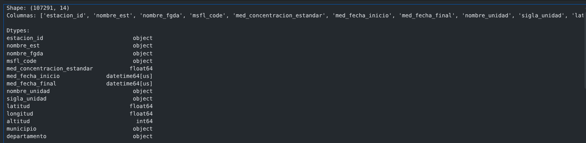
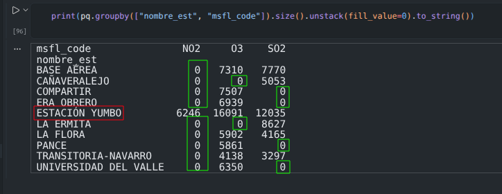
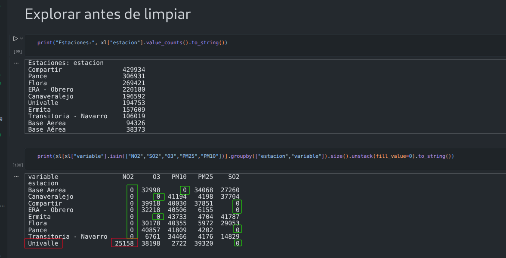
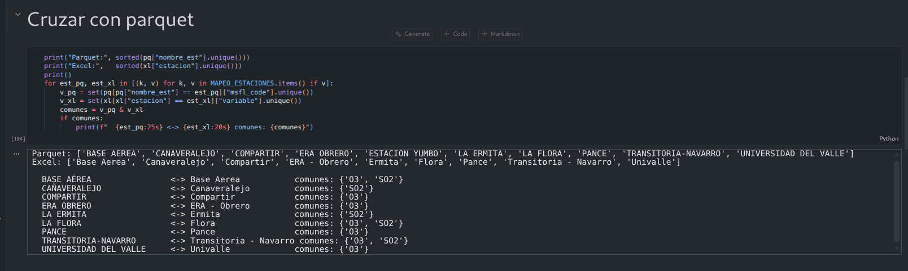
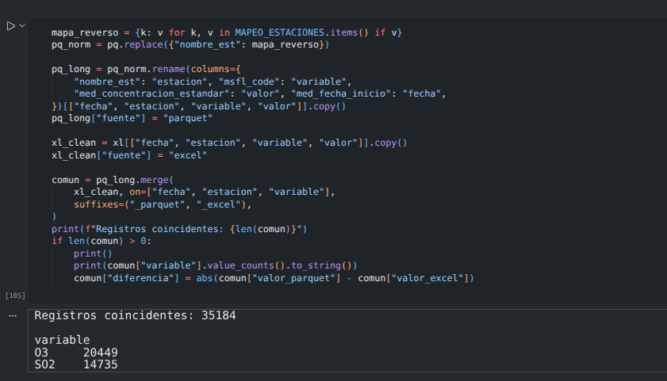
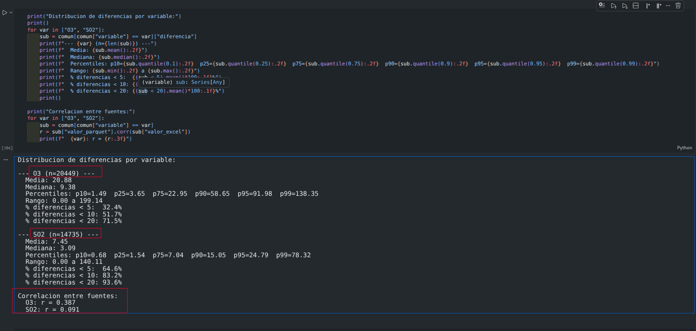
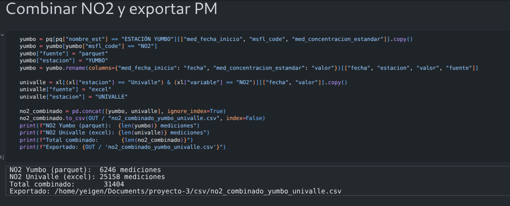
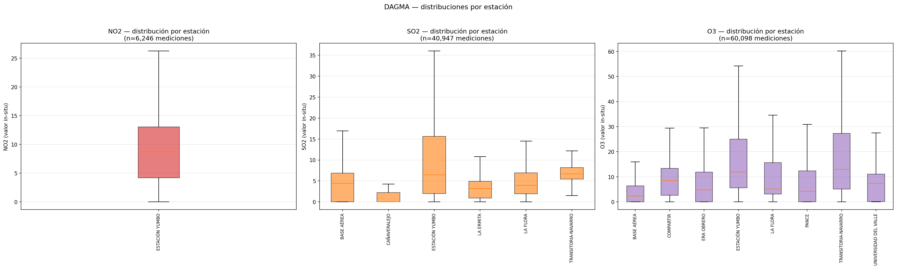
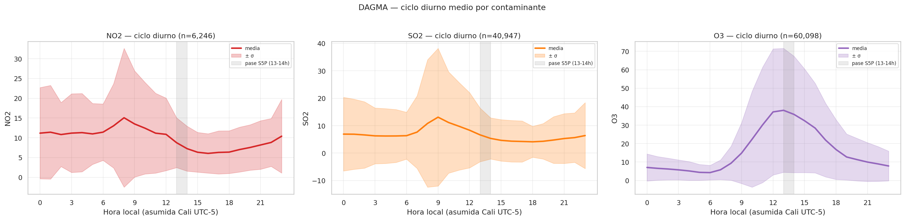
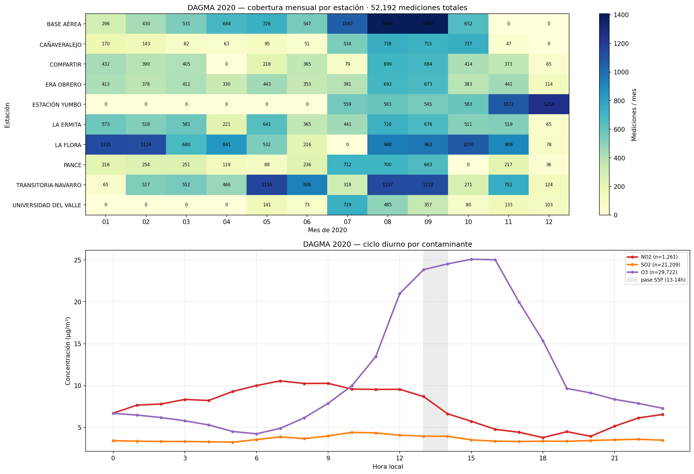

# Justificación del cruce DAGMA Cristian

## Decisión

Para NO2, SO2 y O3, el ground truth principal será el parquet SISAIRE/DAGMA-CVC:

- `dagma/dagma_cvc_horario_raw.parquet`
- `dagma/estaciones_metadata.csv`
- `dagma/manifest_ground_truth.json`

El Excel de Cristian (`dagma/dagma-cristian.xlsx`) y los CSV derivados se conservan como fuentes complementarias. No se mezclan con el parquet como ground truth principal porque no son estadísticamente equivalentes.

## 1. Fuente canónica: parquet SISAIRE/DAGMA-CVC

El parquet tiene un esquema normalizado: fecha, estación, contaminante, valor, unidad y coordenadas por fila. Además, tiene manifest con trazabilidad de origen.

Criterios para usarlo como ground truth:

- Rango controlado: 2020-01-01 a 2024-12-31.
- 10 estaciones, incluyendo Yumbo CVC.
- Contaminantes objetivo del proyecto: NO2, SO2 y O3.
- Unidad homogénea: ug/m3.
- Trazabilidad en `dagma/manifest_ground_truth.json`.

## 2. Fuente complementaria: Excel SVCASC de Cristian

El Excel tiene más variables que el parquet: PM10, PM25, H2S, meteorología y Black Carbon. Eso lo hace útil, pero también confirma que es otra fuente/procesamiento.

Diferencias principales:

| Criterio | Parquet SISAIRE/DAGMA-CVC | Excel Cristian |
|---|---|---|
| Rango | 2020-2024 | 2020-2025 |
| Estaciones | 10, incluye Yumbo CVC | 9 DAGMA |
| Variables | NO2, SO2, O3 | NO2, SO2, O3, PM, H2S, meteorología |
| Formato | Largo, normalizado | Ancho, encabezados multinivel |
| Uso recomendado | Ground truth principal | Fuente auxiliar |

El Excel no se descarta. Se usa como apoyo para variables que el parquet no tiene, pero no reemplaza la fuente canónica de NO2/SO2/O3.

## 3. Cruce parquet vs Excel

Se cruzaron ambas fuentes por fecha, estación y variable. El cruce produjo 35,184 registros coincidentes.

El cruce no prueba equivalencia. Solo dice que existen registros comparables en fecha, estación y variable. Para decidir si una fuente puede reemplazar a la otra, hay que mirar correlación y diferencias.

## 4. Evidencia estadística: no son fuentes equivalentes

| Variable | Registros | Correlación r | Diferencia media | Mediana diferencia | p75 diferencia |
|---|---:|---:|---:|---:|---:|
| O3 | 20,449 | 0.387 | 20.88 ug/m3 | 9.38 | 22.95 |
| SO2 | 14,735 | 0.091 | 7.45 ug/m3 | 3.09 | 7.04 |

### Qué significa correlación

La correlación mide qué tanto dos variables se mueven juntas. Va de -1 a 1:

- r cercano a 1: ambas fuentes suben y bajan juntas.
- r cercano a 0: casi no hay relación lineal.
- r negativo: una sube cuando la otra baja.

En este cruce, O3 tiene r=0.387 y SO2 r=0.091. O3 apenas muestra relación baja/moderada. SO2 prácticamente no se mueve igual entre fuentes.

### Qué significan media y mediana de diferencias

La diferencia media resume el error promedio entre fuentes. La mediana muestra el error típico sin quedar tan afectada por valores extremos.

Para O3, la diferencia media es 20.88 ug/m3 y la mediana 9.38 ug/m3. Para SO2, la diferencia media es 7.45 ug/m3 y la mediana 3.09 ug/m3. Son diferencias demasiado grandes para tratar ambos archivos como si fueran el mismo ground truth.

Conclusión estadística: Excel y parquet no son intercambiables para NO2/SO2/O3 sin una auditoría adicional de unidades, calibración, agregación temporal y fuente.

## 5. Caso NO2: por qué el combinado no será ground truth principal

El parquet tiene NO2 solo en Yumbo. El Excel tiene NO2 en Univalle. Combinarlos aumenta el número de mediciones, pero mezcla dos cosas al mismo tiempo: estación y fuente.

| Fuente | Estación | Mediciones NO2 |
|---|---|---:|
| Parquet | Yumbo | 6,246 |
| Excel | Univalle | 25,158 |
| Combinado | Yumbo + Univalle | 31,404 |

Esto genera confusión estadística: si el modelo ve diferencias entre Yumbo y Univalle, no sabemos si vienen de diferencias espaciales reales o de diferencias entre fuentes.

Por eso `csv/dagma/no2_combinado_yumbo_univalle.csv` puede usarse como experimento separado, siempre marcando la fuente. No debe mezclarse silenciosamente con el ground truth principal.

## 6. Soporte EDA DAGMA

Las figuras del EDA ayudan a explicar la cobertura espacial, temporal y por contaminante.

### Estaciones y BBox

Esta figura muestra que las estaciones están dentro del dominio operativo del proyecto y permite distinguir la estación CVC Yumbo de las estaciones DAGMA.

### Cobertura temporal

La cobertura no es homogénea. Algunas estaciones tienen muchos más meses activos que otras. Esto afecta LOO-CV porque no todas las estaciones aportan la misma cantidad de observaciones.

### Distribuciones por estación y contaminante

Cada contaminante tiene distinta disponibilidad por estación. NO2 es el caso más limitado: en el parquet solo aparece en Yumbo.

### Ciclo diurno

El ciclo diurno muestra que los picos de NO2 y SO2 no necesariamente coinciden con el pase satelital de Sentinel-5P. Esto justifica usar datos horarios y no solo promedios satelitales.

### Año 2020

DAGMA tiene datos en 2020, pero el panel satelital útil comienza en 2021. Por eso 2020 sirve como contexto histórico, no como validación directa del panel satelital.

## 7. Decisión de uso

| Fuente | Uso recomendado | Motivo |
|---|---|---|
| `dagma/dagma_cvc_horario_raw.parquet` | Ground truth principal para NO2, SO2 y O3 | Tiene manifest, esquema normalizado y trazabilidad. |
| `dagma/dagma-cristian.xlsx` | Fuente complementaria | Aporta PM10, PM25, H2S y meteorología, pero no coincide bien con parquet para O3/SO2. |
| `csv/dagma/dagma_excel_limpio.csv` | Análisis auxiliar | Es el Excel procesado a formato largo. |
| `csv/dagma/cruce_parquet_excel.csv` | Evidencia de comparación | Contiene registros coincidentes y diferencias entre fuentes. |
| `csv/dagma/no2_combinado_yumbo_univalle.csv` | Experimento NO2 separado | Aumenta estaciones, pero mezcla fuente y estación. |

## Conclusión

No se descarta el Excel de Cristian. Se conserva como fuente complementaria.

La decisión es no usarlo como ground truth principal para NO2, SO2 y O3 porque el cruce con el parquet muestra baja concordancia estadística. Para NO2, además, el combinado Yumbo-Univalle mezcla fuente y estación, lo que impide separar si las diferencias vienen del territorio o del origen del dato.

La validación principal de Sit 3 debe usar el parquet SISAIRE/DAGMA-CVC. El Excel puede apoyar análisis auxiliares de PM, meteorología y experimentos separados, siempre marcando la fuente de cada medición.
